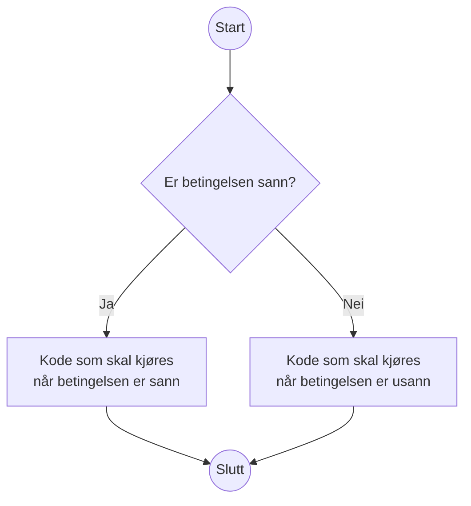
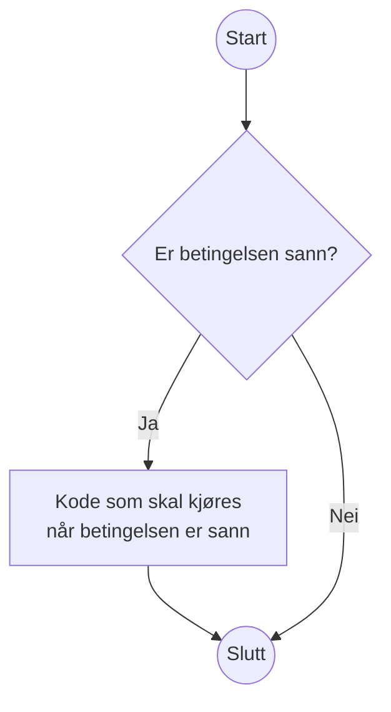
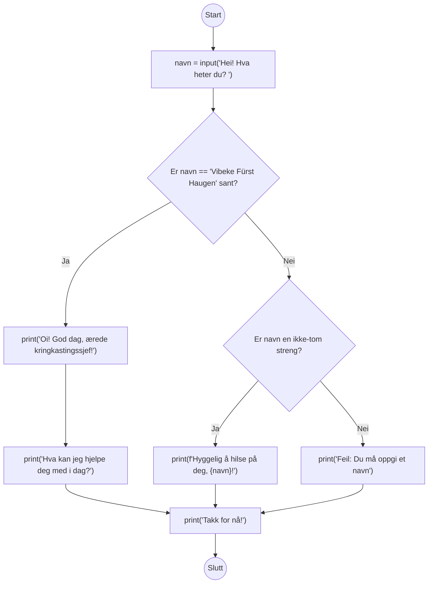

Dag 0: Introduksjon til Python
==============================
_Hei og velkommen til Pythonkurs for viderekomne! Som en myk start, skal vi se litt på hvordan man bruker Python, og de helt enkle verktøyene som finnes i dette programmeringsspråket._

Hei på deg Python
-----------------
**💡 Læringsmål:** _I dette avsnittet skal du lære deg å kjøre Python-programmer i terminalen._

Når man lærer seg et programmeringsspåk, er ofte det første programmet man skrivet et ["Hallo verden"-program](https://en.wikipedia.org/wiki/%22Hello,_World!%22_program). Dette er helt enkelt et program som skriver ut teksten "Hallo verden". La oss skrive et sånt program sammen!

### Filer og mapper
Filer bor i mapper, og det kan være nyttig å lage en mappe som inneholder alle filene du skal lage i dette kurset. Vi kommer til å bruke en mappe som heter `kurs/` i denne kursbeskrivelsen. I denne mappen kan du lage en fil som heter `hallo_verden.py`. Når du har gjort det, kan du åpne filen i VS Code, og legge inn koden som er vist under:

```python
print("Hallo verden")
```

Når du har lagt inn koden i filen, lagrer du den og starter en terminal som [Powershell på Windows](https://learn.microsoft.com/en-us/powershell/scripting/windows-powershell/starting-windows-powershell), [Terminal på Mac](https://support.apple.com/guide/terminal/open-or-quit-terminal-apd5265185d-f365-44cb-8b09-71a064a42125/mac) eller noe tilsvarende på Linux.

I den åpne terminalen, navigerer du ned i `kurs/`-mappen med f.eks. kommandoen `cd`.

```shell
$> cd kurs/
kurs $>
```

_Det kan være du må navigere lenger enn bare rett ned i `kurs/`-mappen på din maskin. Dette er avhengig av hvilken mappe terminalen åpnet seg i. For å gå ut av en mappe kan man bruke kommandoen `cd ..`. Avhengig av hvilket operativsystem du bruker, kan det også være mulig å åpne terminalen direkte i `kurs/`-mappen, fra filutforskeren._

Da skal vi kjøre Pythonkoden! Dette gjør du helt enkelt ved å kjøre kommandoen `python`

```shell
kurs $> python hallo_verden.py
Hallo verden
```

_Hvis du bruker Linux, kan det være at du må kjøre kommandoen `python3` i stedet for `python`. Hvis dette er tilfellet, bruker du bare denne kommandoen alle steder hvor det er referert til `python` i denne kursbeskrivelsen._

Gratulerer! Du har nå kjørt ditt første Pythonprogram.

### Sånn printer du til terminalen
I programmet over brukte vi funksjonen `print(...)` til å ...

_Her forklarer vi litt hvordan print fungerer, og en veldig kort forklaring på hva en funksjon er og gjør._

✍️ **Oppgave:** _Kan du utvide `hallo_verden.py`, sånn at den printer ut en tekst til?_


Kommentarer (Teodor)
-----------
**💡 Læringsmål:** _I dette avsnittet skal du lære deg å skrive forklaringer som kan ligge sammen med koden._

_Her forklarer vi at du kan kommentere med forklarende tekst, og at du kan "kommentere ut" kodelinjer og kanskje også multiline-kommentarer_

✍️ **Oppgave:** _Kan du skrive en kommentar på hva du prøver å få til med en `print`-linje i `hallo_verden.py`_
<!-- TODO: Kanskje dette kan være eksemplet vårt? -->

✍️ **Oppgave:** _Kan du kommentere ut en `print`-linje i `hallo_verden.py`, og observere hva som da skjer når du kjører programmet?_


Enkle datastrukturer og variabler (Teodor)
---------------------------------
**💡 Læringsmål:** _I dette avsnittet skal du lære deg å bruke enkle datastrukturer som tall, tekst og boolske verdier. I tillegg skal vi se litt på variabler._

### Tall
- Operasjoner som `+`, `-`, `*`, `%`, `**`, `/` og `//`.
- Typer tall `int`, `float`.

### Variabler
- Tilegne verdier til en variabel
- Gyldige variabelnavn
  - Inkludert æøå?
- gode variabel navn `sesong_nummer = 4`
    - tips om finne gode variabelnavn ved å se det variabelen skal brukes til
- Bruke en variabel
- `i = 2` `i +=1 `

```python
i = 14
print(i)
i = 45
print(i)
a = 2
b = 3
c = a + b
```

### Strenger
- Hvordan lager du de? `"`
- Kunne escape enkelte tegn
- Multiline-strenger `'''`
- Hvordan gjør
- `contains`, `split`, `in`
- Bruke programID som eksempel
- Bruke medvirkende som eksempel
    - Sørge for stor forbokstav osv.
- Vise hvordan man bruker f-strenger
    - _Du kan også bruke `+` for å konkatinere strenger, men f-strenger er anbefalt_
- https://docs.python.org/3/library/string.html

### Boolske verdier
- `True`, `False`, and or not, hvordan parenteser kan påvirke ting

| `a`     | `b`     | `a and b` |
| ------- | ------- | --------- |
| `True`  | `False` | `False`   |
| `False` | `True`  | `False`   |
| `False` | `False` | `False`   |
| `True`  | `True`  | `True`    |

| `a`     | `b`     | `a or b` |
| ------- | ------- | -------- |
| `True`  | `False` | `True`   |
| `False` | `True`  | `True`   |
| `False` | `False` | `False`  |
| `True`  | `True`  | `True`   |

| `a`     | `not a` |
| ------- | ------- |
| `True`  | `False` |
| `False` | `True`  |

- Faske og sanne verdier f.eks. `not 0`
- Kortslutning av boolske uttrykk

```python
a = True
c = a or b
print(c)
```

```python
a = ""
b = "hei igjen"
c = a or b
```

Input (Thorben)
-----
**💡 Læringsmål:** _I dette avsnittet skal du lære deg å få inn data fra brukeren._

Fram til nå har vi skrevet tekst fra programmet til terminalen.
Men hvis du har villet endre hvilke verdier programmet ditt opererte på,
så har du måttet gå inn i koden og gjøre endringene der.

Hadde det ikke vært mer praktisk hvis du kunne latt koden være den samme,
og heller _spurt brukeren_ om hvilke verdier du skal bruke?
Da kan du kjøre programmet ditt flere ganger, men brukt ulike verdier hver gang.

[Funksjonen `input()`][doc-input] stopper programmet ditt,
og venter på at brukeren som sitter ved terminalen skriver inn ei linje med tekst.
Først når brukeren trykker `[ENTER]` vil programmet ditt fortsette.
Resultatet til `input()` er teksten som brukeren skrev,
så hvis du vil ta vare på teksten må du tilegne den til en variabel.

Her er et program som bruker `print()` til å _skrive til_ terminalen,
etterfulgt av `input()` for å _lese fra_ terminalen:

```python
# hilsen.py
print("Hei! Hva heter du?")
navn = input()
print(f"Så hyggelig å hilse på deg, {navn}!")
```

Når du kjører dette i terminalen, kan det se sånn her ut:

```shell-session
kurs $> python hilsen.py
Hei! Hva heter du?
Vibeke
Så hyggelig å hilse på deg, Vibeke!
```

✍️ **Oppgave:**
_Eksperimenter med å kjøre eksemplet ovenfor i terminalen.
Hva skjer når du skriver inn mange mellomrom før og etter navnet?
Hva skjer hvis du ikke skriver inn noe navn før du trykker `[ENTER]`?_


### Snarvei for å stille spørsmålet og hente svaret samtidig

Det finnes en snarvei du kan bruke for å stille spørsmålet som brukeren
skal svare på i samme slengen som du henter svaret: `input(prompt)`.
Teksten du sender inn vil bli skrevet til terminalen (likt som med `print`),
men den vil ikke avslutte med linjeskift.
Resultatet er at når brukeren begynner å skrive,
vil svaret stå på samme linje som spørsmålet.

Grunnen til at du helst bør bruke en prompt,
er at det lar brukerne av programmet ditt vite at programmet venter på dem.
Det trenger ikke alltid være så åpenbart hvorvidt programmet bare har tatt seg en tenkepause,
eller om det venter på brukeren.
For terminalprogram er det derfor en innarbeidet konvensjon om at hvis du skal ta inn noe fra brukeren,
skal du indikere det ved å la markøren stå på samme linje som spørsmålet,
eller starte linja med `> ` (altså «større enn»-tegnet etterfulgt av mellomrom).

Her er samme eksemplet som ovenfor,
gjort om til å stille spørsmålet på samme linje som brukeren skal skrive svaret:

```python
# hilsen_med_prompt.py
navn = input("Hei! Hva heter du? ")
print(f"Så hyggelig å hilse på deg, {navn}!")
```

Når du kjører dette i terminalen, kan det se sånn her ut:

```shell-session
kurs $> python hilsen_med_prompt.py
Hei! Hva heter du? Vibeke
Så hyggelig å hilse på deg, Vibeke!
```

✍️ **Oppgave:**
_Hvorfor er det et ekstra mellomrom etter spørsmålstegnet i eksemplet ovenfor?
Hva skjer hvis du fjerner det?_


### Lese inn andre typer enn streng

Hittil har vi kun lest inn strenger med `input()`.
Og det er i grunn det eneste `input()` kan gi oss: strenger.

La oss si at vi vil lese inn brukerens alder, i tillegg til navn.
Her er første utkast:

```python
# input_alder_feil.py
print("Hva heter du?")
navn = input("> ")

print(f"Hei, {navn}! Hvor mange år er du?")
alder = input("> ")
print(f"Ok, så du er {alder} år gammel. ")

print("Klarer vi regne ut hvor gammel du vil være om et år?")
neste_alder = alder + 1
print(f"Du vil være {neste_alder} år om et år!")
```

✍️ **Oppgave:**
_Skriv av eksemplet ovenfor og kjør det i terminalen.
Hva skjer? Kan du se hvorfor?_

Hvis du vil lese inn noe annet enn tekst fra brukeren, for eksempel et tall,
så må du selv gjøre jobben med å konvertere brukerens svar til den riktige datatypen.
For heltall kan du gjøre det med [`int(x)`][doc-int-funk].

Her er en fungerende versjon av eksemplet ovenfor:

```python
# input_alder_fikset.py
print("Hva heter du?")
navn = input("> ")

print(f"Hei, {navn}! Hvor mange år er du?")
rå_alder = input("> ")
print(f"Ok, så du er {rå_alder} år gammel. ")

print("Klarer vi regne ut hvor gammel du vil være om et år?")
konvertert_alder = int(rå_alder)
neste_alder = konvertert_alder + 1
print(f"Du vil være {neste_alder} år om et år!")
```

Kjører du dette i terminalen, kan de se sånn ut:

```shell-session
kurs $> python input_alder_fikset.py
Hva heter du?
> Vibeke
Hei, Vibeke! Hvor mange år er du?
> 54
Ok, så du er 54 år gammel.
Klarer vi regne ut hvor gammel du vil være om et år?
Du vil være 55 år om et år!
```

✍️ **Oppgave:**
_Skriv av eksemplet ovenfor og test det ut i terminalen. 
Hva skjer hvis du leker at du er en tullebukk som skriver inn tullesvar?
Gjør programmet noen antakelser om hva brukeren skriver?_

I tillegg til `int(x)` kan du også konvertere til flyttall med [`float(x)`][doc-float-funk].


### Stille ja/nei-spørsmål

Du kan ofte ha behov for å stille kontrollspørsmål til brukeren.
Det kan for eksempel være at du vil spørre om bekreftelse før du overskriver ei fil.


#### Hvorfor ikke `bool(x)`?

Ovenfor så vi at du kan bruke `int(x)` og `float(x)` til å konvertere en streng til typen `int` eller `float`.
Hva så med boolske verdier — kan vi konvertere dem med `bool(x)`?
Vi kan teste det ut i en interaktiv Python-sesjon:

```shell-session
kurs $> python
Python 3.10.9 (main, Dec  7 2022, 01:12:00) [GCC 9.4.0] on linux
Type "help", "copyright", "credits" or "license" for more information.
>>> bool("True")
True
>>> bool("yes")
True
>>> bool("y")
True
>>> bool("ja")
True
>>> 
```

Så langt ser jo dette lovende ut. Hva så med nei?

```shell-session
>>> bool("nei")
True
>>> bool("no")
True
>>> bool("False")
True
>>> bool("")
False
```

Oi, dette gikk visst ikke så bra.
Det eneste som ble konvertert til `False` var en tom streng.
Hva er det som skjer?

Alle objekter har en implisitt boolsk verdi,
med ulike regler for ulike typer.
For strenger så er denne implisitte boolske verdien `True`,
bortsett fra for tomme strenger — de er `False`.

Når du kaller `bool(x)`, 
får du den implisitte verdien til objektet som du sender inn.
Derfor blir `"False"` tolket til `True`:
Det er en ikke-tom streng, så da er den `True`.

#### Eksempel på problemløsing: Tolke ja/nei-svar

Hvis vi skal få til å tolke svaret på ja/nei-spørsmål,
må vi i grunn gjøre en god del arbeid.
La oss starte med å lage en liste med krav:

* `"y"`, `"Y"`, `"Yes"` og `"yes"` skal tolkes som `True`
* `"n"`, `"N"`, `"No"` og `"no"` skal tolkes som `False`
* Hvis du bare trykker `[ENTER]` skal du bruke en forvalgt verdi

Dette er ganske mange krav...
I stedet for å skulle løse alt på én gang,
er det enklere å bare starte med én bit.
La oss starte med å bare godta `"y"` for `True`, og anta alt annet som `False`.

##### Runde 1: Godta kun y som «ja»

```python
# input_ja_nei_v1.py
print("La oss late som at programmet ønsker å opprette ei fil.")
vil_fortsette = input("Vil du fortsette (Y/n)? ")
vil_fortsette_tolket = vil_fortsette == "y"
print(f"{vil_fortsette_tolket=}")
```

I spørsmålet har vi skrevet `(Y/n)`.
Dette kommuniserer to ting til brukeren:

1. Vi stiller et yes/no-spørsmål
2. Hvis du bare trykker `[ENTER]`, vil programmet anta svaret er `"yes"`

Hvis vi derimot hadde skrevet `(y/N)` ville vi kommunisert at forvalget hadde vært `"no"`.
(Legg merke til hvilken bokstav som er stor.)

En annen teknikk vi har brukt,
er å sette likhetstegn etter uttrykket som vi ønsker å vise frem i f-strengen:

```python
f"{vil_fortsette_tolket=}"
```

Dette er en snarvei som vil vise _både_ uttrykket du har brukt _og_
resultatet av uttrykket.
For eksempel vil det stå `vil_fortsette_tolket=True` hvis du svarte `y`.

Hvis du prøvekjører dette programmet i terminalen,
vil du fort nok oppdage tre feil:
* `"Y"` (en stor y) blir tolket som `False`
* `"yes"` blir tolket som `False`
* Hvis du bare trykker `[ENTER]` får du `False`, selv om forvalget er `True`.

La oss prøve å løse det første problemet først.


##### Runde 2: Ignorer store/små bokstaver

Hvis vi konverterer til [minuskler][minuskel] (små bokstaver) først,
kan vi beholde sammenlikningen som den er.

```python
# input_ja_nei_v2.py
print("La oss late som at programmet ønsker å opprette ei fil.")
vil_fortsette = input("Vil du fortsette (Y/n)? ")
# Ignorer forskjellen på store og små bokstaver ved å
# normalisere til små bokstaver
vil_fortsette_minuskler = vil_fortsette.lower()
vil_fortsette_tolket = vil_fortsette_minuskler == "y"
print(f"{vil_fortsette_tolket=}")
```

Nå gjenstår kun to problemer.
La oss gå løs på problemet med at `"yes"` blir tolket som `False`.

##### Runde 3: Godta yes som «ja»

```python
# input_ja_nei_v3.py
print("La oss late som at programmet ønsker å opprette ei fil.")
vil_fortsette = input("Vil du fortsette (Y/n)? ")
vil_fortsette_minuskler = vil_fortsette.lower()
# Ignorer alle bokstaver etter den første
vil_fortsette_forbokstav = vil_fortsette_minuskler[0]
vil_fortsette_tolket = vil_fortsette_forbokstav == "y"
print(f"{vil_fortsette_tolket=}")
```

Vi sammenlikner fortsatt bare med `"y"`,
men det kan vi gjøre siden vi bare henter ut den første bokstaven brukeren skrev.
Vi har dog introdusert et nytt problem, for hva skjer hvis du ikke skriver noe?

```shell-session
kurs $> python input_ja_nei_v3.py
La oss late som at programmet ønsker å opprette ei fil.
Vil du fortsette (Y/n)? 
Traceback (most recent call last):
  File "input_ja_nei_v3.py", line 4, in <module>
    vil_fortsette_forbokstav = vil_fortsette_minuskler[0]
IndexError: string index out of range
```

Når vi gjør `vil_fortsette_minuskler[0]`,
antar vi at det er minst ett tegn i strengen.
Den antakelsen holder ikke når du ikke skriver inn noe før du trykker `[ENTER]`.

##### Runde 4: Ikke krasj ved tom verdi

Kan vi tilpasse koden så den ikke gjør noen antakelser om strengen,
men heller aksepterer at den kan være tom?

Her kan vi utnytte det faktum at en _slice_ godtar en slutt forbi slutten på strengen.
Du kan eksperimentere selv i en interaktiv Python-sesjon:

```shell-session
kurs $> python
Python 3.10.9 (main, Dec  7 2022, 01:12:00) [GCC 9.4.0] on linux
Type "help", "copyright", "credits" or "license" for more information.
>>> "yes"[0]
'y'
>>> ""[0]
Traceback (most recent call last):
  File "<stdin>", line 1, in <module>
IndexError: string index out of range
>>> "yes"[0:1]
'y'
>>> ""[0:1]
''
```

Hvis vi bruker denne nyvunne kunnskapen i eksemplet vårt,
kan det bli seende sånn her ut:

```python
# input_ja_nei_v4.py
print("La oss late som at programmet ønsker å opprette ei fil.")
vil_fortsette = input("Vil du fortsette (Y/n)? ")
vil_fortsette_minuskler = vil_fortsette.lower()
# Fortsett med å ignorere alle tegn etter det første,
# men la en tom streng forbli tom
vil_fortsette_forbokstav = vil_fortsette_minuskler[0:1]
vil_fortsette_tolket = vil_fortsette_forbokstav == "y"
print(f"{vil_fortsette_tolket=}")
```

Legg merke til at `[0:1]` kan forkortes til `[:1]`, siden starten er `0`.

`vil_fortsette_forbokstav` vil bli satt til det første tegnet hvis det finnes,
ellers en tom streng.

Det siste problemet som gjenstår er å få `True` som forvalg.

##### Runde 5: Godta tom verdi som «ja»

```python
# input_ja_nei_v5.py
print("La oss late som at programmet ønsker å opprette ei fil.")
vil_fortsette = input("Vil du fortsette (Y/n)? ")
vil_fortsette_minuskler = vil_fortsette.lower()
vil_fortsette_forbokstav = vil_fortsette_minuskler[:1]
# Aksepter tom streng, i tillegg til "y", som sann
vil_fortsette_tolket = (
    vil_fortsette_forbokstav == "y"
    or vil_fortsette_forbokstav == ""
)
print(f"{vil_fortsette_tolket=}")
```

Det er fortsatt en svakhet her:
Du kan skrive hva som helst,
og det vil bli tolket som «nei» så lenge det ikke starter på bokstaven y.
Vi kunne valgt å kjefte på brukeren hvis de gjorde noe så tullete,
men for enkelthetens skyld antar vi heller at brukeren ikke vil fortsette.

##### Runde 6: Trekk sammen til ei linje

Nå har vi gjort én ting av gangen i dette eksemplet,
men du kan ta noen snarveier og få til det samme i færre kodelinjer:

```python
# input_ja_nei_v6.py
print("La oss late som at programmet ønsker å opprette ei fil.")
vil_fortsette = input("Vil du fortsette (Y/n)? ").lower()[:1] in ("y", "")
print(f"{vil_fortsette=}")
```

Her har vi gjort alle mellomstegene samtidig.
Vi har også brukt `in`-operatoren til å sjekke om uttrykket på venstre hånd
(den første bokstaven til brukeren som minuskel)
er å finne i tuplen av verdier på høyre hånd (`"y"` eller `""`).

Programmet oppfører seg helt likt som versjon 5,
det er bare litt vanskeligere å lese,
men desto kortere.
Balansegangen mellom «lettforståelig, men langt» og «kort, men vanskelig å lese»
kan være vanskelig å få rett.
I dette tilfellet hadde nok den beste løsninga vært å bruke den lange varianten,
men gjemt den bort som en gjenbrukbar funksjon.
Da tar den liten plass der hvor du spør brukeren om hen vil fortsette,
samtidig som du kan gå til den lange versjonen
når du trenger å tilpasse den eller se hvordan den funker.
Du lærer deg hvordan du kan lage slike funksjoner helt i slutten av denne delen.

Når du kjører eksemplet, kan det se sånn her ut:

```shell-session
kurs $> python input_ja_nei_v6.py
La oss late som at programmet ønsker å opprette ei fil.
Vil du fortsette (Y/n)? No
vil_fortsette=False
```

✍️ **Oppgave:**
_La oss si at vi ønsker å_ slette _ei fil i stedet.
Da bør jo forvalget være `False`, for å unngå uhell.
Klarer du tilpasse `input_ja_nei_v5.py` sånn at den antar `False`
når brukeren bare trykker `[ENTER]` uten å skrive noe?_

✍️ **Oppgave:**
_I eksemplet ovenfor antok vi at brukeren svarte på engelsk.
Klarer du tilpasse `input_ja_nei_v5.py` sånn at brukeren kan svare på norsk (ja/nei)?_

Det er en ganske åpenbar bit som mangler i eksemplet vi har bygd ut her:
Det spiller ingen rolle om du svarer ja eller nei.
Det vil så klart skrives ulike ting til terminalen,
men programmet vil utføre de samme instruksjonene uansett hva du svarer.
Hvordan kan programmet gjøre ulike ting, avhengig av hva du svarer?

[doc-input]: https://docs.python.org/3/library/functions.html#input
[doc-int-funk]: https://docs.python.org/3/library/functions.html#int
[doc-float-funk]: https://docs.python.org/3/library/functions.html#float
[doc-bool-funk]: https://docs.python.org/3/library/functions.html#bool
[minuskel]: https://ordbokene.no/bm/38583


Hvis, omatte og ellers (Thorben)
----------------------
**💡 Læringsmål:** _I dette avsnittet skal du lære deg å skrive kode som gjør valg._

Hittil har programmene våre kjørt fra topp til bunn:
Så snart det har gjort seg ferdig med én instruks,
har programmet fortsatt med neste.
Det øyeblikket du begynner å få spesialtilfeller som skal behandles på forskjellige måter,
får du behov for å variere hva koden gjør.

De aller fleste programmeringsspråk har det som kalles for betingelser (conditionals).
De kan sammenliknes med flytdiagram som du kanskje har støtt på i andre tilfeller:



Her er en illustrasjon på hvordan betingelser ser ut i Python:

```python
# illustrasjon_if_else.py
print("Start")
if 2 + 2 == 4:
    print("Denne koden kjøres hvis betingelsen er sann")
    print("Du kan ha flere kodelinjer")
else:
    print("Denne koden kjøres hvis betingelsen er usann")
    
    print("Du kan ha flere kodelinjer her også")
print("Slutt")
```

Eksempel på kjøring:

```shell-session
kurs $> python illustrasjon_if_else.py
Start
Denne koden kjøres hvis betingelsen er sann
Du kan ha flere kodelinjer
Slutt
```

Hvordan klarer Python å skille mellom koden som skal kjøre avhengig av betingelsen,
og resten av koden?
Svaret er _kodeblokker_.
Ei kodeblokk er ei samling med kode som hører sammen og blir eksekvert sammen.
I Python bruker vi et kolon på slutten av ei linje til å indikere at «her kommer ei kodeblokk!».
Hver linje som inngår i kodeblokken må ha et større innrykk enn koden rundt, for eksempel fire mellomrom.
Den første linja som har mindre innrykk avslutter kodeblokken og vil ikke inngå i den.
(Blanke linjer er tillatt.)

### Innrykk er viktig i Python

Du vil som oftest få hjelp av editoren din,
for eksempel vil den legge på innrykk når du skriver `if:[ENTER]`.
Utenom automatikken kan du som oftest bruke `[TAB]`-tasten til å lage et passelig stort innrykk,
men husk på at en tabulator er noe annet enn et mellomrom.
Mange editorer vil sette inn mellomrom når du trykker `[TAB]`
i stedet for å sette inn et tabulator-tegn,
men hvis den ikke gjør det og du blander tabulator med mellomrom får du trøbbel:

```python
# feil_innrykk.py
if 2 + 2 == 4:
        print("Hei")
	print("Hallo")
```

Du kan ikke se det med det blotte øye,
men her har vi brukt mellomrom på «Hei» og tabulator på «Hallo».
Prøver du å kjøre dette, får du feil:

```shell-session
kurs $> python feil_innrykk.py
  File "/home/n123456/kurs/feil_innrykk.py", line 3
    print("Hallo")
TabError: inconsistent use of tabs and spaces in indentation
```
Det finnes en måte du kan åpne opp øynene dine for ulike typer mellomrom.
I Visual Studio Code kan du velge View, Appearance og Render Whitespace.
Vanlig mellomrom blir vist som prikker,
mens en tabulator blir vist som ei pil.
Feilen ovenfor løser du ved å bare bruke det ene eller det andre,
aldri en blanding.

I Visual Studio Code kan du velge hva slags innrykk den skal bruke.
Du må se nederst til høyre i vinduet, der hvor det står «Ln #, Col #» (med tall i stedet for #).
Dette er linja og kolonna markøren din står i.
Etter denne står det hva slags innrykk editoren bruker, for eksempel «Spaces: 4».
Trykk på denne for å endre typen innrykk og størrelsen på innrykket.

Det er utkjempet kriger på internett over hva som er riktig av mellomrom og tabulator,
så vi nøyer oss med å si at mellomrom gjør at koden ser lik ut for alle,
mens tabulator lar ulike personer justere hvor mange «mellomrom» en tabulator skal tilsvare visuelt.
Det viktigste er at du bruker én av de konsekvent i hele prosjektet;
hvilken du bruker er underordnet.

### Du kan droppe `else`

Noen ganger har du ikke noe du vil gjøre i `else`.
Da kan du bare droppe den, og ha en `if` med tilhørende kodeblokk.

Som flytdiagram:



Som Python-kode:

```python
# illustrasjon_if.py
print("Start")
if 2 + 2 == 5:
    print("Denne koden kjøres hvis betingelsen er sann")
    print("Du kan ha flere kodelinjer")
print("Slutt")
```

Eksempel på kjøring:

```shell-session
kurs $> python illustrasjon_if.py
Start
Slutt
```


### Eksempel: Hilsen

Vi kan bygge videre på hilsenen vi lagde oss i forrige seksjon.
Klarer vi å reagere på det brukeren skriver?

```python
# hilsen_med_if.py
navn = input("Hei! Hva heter du? ")
if navn == "Vibeke Fürst Haugen":
    print("Oi! God dag, ærede kringkastingssjef!")
    print("Hva kan jeg hjelpe deg med i dag?")
else:
    if navn:
        print(f"Hyggelig å hilse på deg, {navn}!")
    else:
        print("Feil: Du må oppgi et navn")
print("Takk for nå!")
```

Her har vi brukt `if` og `else` inni `else`.
Det går helt fint an å kombinere dem på denne måten,
i så mange lag bortover som du ønsker.
Hvor praktisk det blir, er et annet spørsmål...

Eksempel på kjøring:

```shell-session
kurs $> python hilsen_med_if.py
Hei! Hva heter du? Vibeke Fürst Haugen
Oi! God dag, ærede kringkastingssjef!
Hva kan jeg hjelpe deg med i dag?
Takk for nå!
kurs $> python hilsen_med_if.py
Hei! Hva heter du? 
Feil: Du må oppgi et navn
Takk for nå!
kurs $> python hilsen_med_if.py
Hei! Hva heter du? Thorben
Hyggelig å hilse på deg, Thorben!
Takk for nå!
```

Hvordan ville dette sett ut som flytdiagram?



### Snarvei: Kombinere `else` og `if`

Python har en snarvei du kan bruke til å kombinere `else` og `if`.
Denne snarveien heter selvfølgelig `elif`.

I forrige seksjon hadde vi en `if` inne i kodeblokken som hørte til en `else`.
Det går kanskje greit når du bare har én sånn if/else-struktur inni i en annen,
men du får fort en veldig lang venstremargin når du får tre eller flere spesialtilfeller.

For å konvertere det forrige eksemplet til å bruke `elif`,
kan du trekke sammen `else:` med `if:` og
redusere innrykket med ett hakk:

```python
# hilsen_med_elif.py
navn = input("Hei! Hva heter du? ")
if navn == "Vibeke Fürst Haugen":
    print("Oi! God dag, ærede kringkastingssjef!")
    print("Hva kan jeg hjelpe deg med i dag?")
elif navn:
    print(f"Hyggelig å hilse på deg, {navn}!")
else:
    print("Feil: Du må oppgi et navn")
print("Takk for nå!")
```

Koden oppfører seg helt likt som før,
den har bare blitt litt lettere å forholde seg til.


### Eksempel: Avslutte programmet tidlig

Nå som vi kan gjøre forskjellige ting avhengig av hva brukeren skriver,
kan vi også få til å gjøre noe bare hvis brukeren ønsker det.
For eksempel kan vi avslutte programmet vårt tidlig
hvis brukeren ikke ønsker å fortsette.

For å få til å avslutte programmet tidlig, må vi _importere_ en modul, i tilfellet her `sys`.
Ved å importere `sys` får vi tilgang til alle funksjonene som ligger i [`sys`-modulen][doc-sys].
En av disse funksjonene er [`sys.exit()`][doc-sys.exit], som kan brukes til å avslutte programmet.
Hvis du sender en streng inn til `sys.exit(arg)` vil strengen printes til konsoll,
før programmet avsluttes med feilkode `1`.

```python
# prompt_fortsett.py
import sys

print("La oss late som at programmet ønsker å slette ei fil.")
vil_fortsette = input("Vil du fortsette (y/N)? ").lower()[:1] == "y"
if not vil_fortsette:
    sys.exit("Avslutter...")
print("Sletter fila...")
```

Her har du et eksempel på `if` uten `elif` eller `else`.
Vanligvis ville programmet ha fortsatt til linja `print("Sletter fila...")` uansett,
men `sys.exit` setter en stopper for det.
En mer naiv løsning hadde vært:

```python
if vil_fortsette:
    print("Sletter fila...")
else:
    print("Avslutter")
```

Svakheten med dette alternativet er at det blir uoversiktlig hvis det er
hundrevis av ting som må gjøres mellom `if` og `else`.
Da blir det ryddigere hvis du heller bare rydder ut av veien tilfellet hvor brukeren vil avbryte,
og kan skrive resten av programmet uten innrykk.
Dette er en vanlig teknikk for å unngå at det blir for mange innrykk til slutt.
Du kan se for deg hvor langt inn du måtte ha rykket koden hvis du skulle spurt om
brukeren vil fortsette et par-tre ganger til.

Eksempel på kjøring:

```shell-session
kurs $> python prompt_fortsett.py
La oss late som at programmet ønsker å slette ei fil.
Vil du fortsette (y/N)? 
Avslutter...
kurs $> python prompt_fortsett.py
La oss late som at programmet ønsker å slette ei fil.
Vil du fortsette (y/N)? yes
Sletter fila...
```

### Eksempel: Bruke forvalgt verdi for input()

Si at du vil ha tak i brukerens navn,
men vil falle tilbake på brukernavnet hvis brukeren ikke skriver noe.
Da kan du _først_ lage en variabel med navnet du vil falle tilbake på,
og så spørre brukeren om navnet.
Hvis brukeren oppga et navn kan vi overskrive variabelen som vi allerede skrev et navn til,
men hvis brukeren ikke oppga noenting, kan vi bare la variabelen være som den er.

For å hente brukernavnet til den innloggede brukeren,
kan vi importere [modulen `getpass`][doc-getpass].
Den har [en funksjon kalt `getpass.getuser()`][doc-getpass.getuser] som forsøker å hente brukernavnet fra systemet.

```python
import getpass

# Bruk brukernavnet som forvalg
navn = getpass.getuser()

oppgitt_navn = input(f"Navn: [{navn}] ").strip()
if oppgitt_navn:
    navn = oppgitt_navn

print(f"Hei, {navn}")
```

En fordel med denne løsninga er at du kan stole på at `navn` har en verdi,
uansett hva brukeren gjør.

PS: Her brukte vi [`str.strip()`][doc-str.strip] til å fjerne mellomrom fra starten og slutten på strengen.
En bieffekt av dette er at du vil få en tom streng, selv hvis du skriver inn mange mellomrom.
På den måten får vi falt tilbake til brukernavnet i tilfellet hvor vi ellers ville brukt strengen
(siden betingelsen `if oppgitt_navn` ville vært oppfylt når `oppgitt_navn == "    "`, med andre ord en ikke-tom streng).


### Tilegne ulik verdi basert på boolsk uttrykk

Det finnes en snarvei du kan bruke alle de gangene du har en variabel som enten skal være det ene eller det andre.
For eksempel når du vil bruke riktig av entall og flertall,
og ikke vet på forhånd hvor mange det er snakk om.

Formatet er:

```python
<verdi hvis sann> if <betingelse> else <verdi hvis usann>
```

Du kan selvfølgelig skrive noe sånt som «Endret 3 fil(er)» og ta høyde for entall og flertall på den måten.
Men du kan også velge å være perfeksjonist:

```python
# entall_flertall.py
antall_filer = int(input("Hvor mange filer vil du endre? "))

# Vi endrer ingenting, det er bare på liksom
fil_substantiv = "fil" if antall_filer == 1 else "filer"
print(f"Endret {antall_filer} {fil_substantiv}")
```

Eksempel på kjøring:

```shell-session
kode $> python entall_flertall.py
Hvor mange filer vil du endre? 9000
Endret 9000 filer
kode $> python entall_flertall.py
Hvor mange filer vil du endre? 1
Endret 1 fil
```

[doc-sys]: https://docs.python.org/3/library/sys.html
[doc-sys.exit]: https://docs.python.org/3/library/sys.html#sys.exit
[doc-getpass]: https://docs.python.org/3/library/getpass.html
[doc-getpass.getuser]: https://docs.python.org/3/library/getpass.html#getpass.getuser
[doc-str.strip]: https://docs.python.org/3/library/stdtypes.html#str.strip


Samlinger (Per Edvard)
---------
**💡 Læringsmål:** _I dette avsnittet skal du lære deg å bruke datastrukturer som samler flere elementer til et sett med informasjon._

Datastrukturer regnes som noe av det mest grunnleggende innenfor programmering. Man samler data i en spesifikk struktur, derav selve beskrivelsen. 
Mye av styrken kommer av mulighetene man har til å utføre bestemte opreasjoner på den lagrede dataen, på en veldig effektiv måte; _gjør X operasjon på alle elementene i lista_
Det finnes en rekke datastrukturer hvor alle har egne regler, styrker og begrensninger. I denne korte introduksjonen skal vi se på tre datastrukturer som alle er mye brukt i Python.

***Lister***

Lister er en samling av elementer i en bestemt rekkefølge. Lister kan inneholde «hva som helst»; strenger, tall, variabler, eller til og med andre datastrukturer.
Det er heller ingen krav til at elementene i lista har en viss tilhørighet til de andre elementene.
Lister i Python er det man på fagspråket kaller «mutable». Elementene i lista kan endres og erstattes, fjernes og nye kan bli lagt til.

En liste defineres på følgende måte:

```python
liste = []
```

Elementer man legger i lista skilles med komma:

```python
kanaler = ["nrk1", "nrk2", "nrk3"]
```

Siden lister følger en bestemt rekkefølge kan man hente ut elementer basert på indeks. Lister i Python starter alltid på indeks 0:

```python
print(kanaler[0])
print(kanaler[-1])              # Negativ indeks går «bakover» i lista. -1 vil hente ut det siste elementet
```

For å modifisere en liste kan man sette elementet på en bestemt indeks til å være noe annet:

```python
kanaler[0] = "nrk11"
```

For å legge til elementer i en liste kan man bruke følgende operasjoner:

```python
kanaler.append("nrk super")     # append() legger til et element i lista. Elementet blir lagt til helt sist i lista

kanaler.insert(1, "nrk tv")     # insert() legger til et element på den valgte indeksen.
                                # Alle andre elmenter på indekser over valgte indeks flyttes «ett steg til høyre»
```

For å fjerne elementer fra en lista kan man bruke følgende operasjoner:
```python
kanaler.remove("nrk2")          # remove() fjerner det første elmenetet som matcher den valgte verdien

del kanaler[0]                  # del() fjerner elementet på den valgte indeksen

slettet_kanal = kanaler.pop()   # pop() fjerner det siste elementet i lista og lar deg «ta vare på verdien»
                                # pop(index) fjerner elementet på en bestemt indeks
```


***Tupler***

Tupler er også en samling av elementer i en bestemt rekkefølge, men skiller seg fra lister ved å være «immutable. Man kan altså ikke endre elementene, fjerne eller legge til nye.

En tuple definerers slik:

```python
tuple = ()
```

På samme måte som ved lister skilles elementer ved hjelp av komma:

```python
kanaler = ("nrk1", "nrk2", "nrk3")
```

For å hente ut elementer fra en tuppel benytter man indeks:

```python
print(kanaler[0])
```

***Oppslagstabeller***

Oppslagstabeller, eller _dictionaries_ er en datastruktur som baserer seg på nøkler med bestemte verdier, istedet for en indeks. 

En oppslagstabell definerers slik:

```python
dict = {}
```

Oppslagstabeller benytter også komma for å skille mellom elementene, men legg merke til at hvert element består av en nøkkel med en tilhørende verdi som er skilt med kolon:

```python
kanaler = {"nrk1" : "20. august 1960", "nrk2" : "1. september 1996", "nrk3" : "3. september 2007"}
```

Man benytter den bestemte nøkkelen for å hente ut tilhørende verdi:

```python
print(kanaler["nrk1"])          # Dette vil skrive ut verdien '20. august 1960'
```

Men hva skjer dersom man forsøker å hente ut en verdi med en nøkkel som ikke finnes?

```python
print(kanaler["tv2"])
```

Eksemplet over vil føre til en KeyError fordi nøkkelen ikke finnes i oppslagstabellen.
Man kan bruke operasjonen get() for å omgå dette problemet:

```python
print(kanaler.get("tv2"))
```

Dette vil da gi deg «verdien» 'None' i stedet for en error. 'None' betyr at det ikke eksisterer noen verdi og er ikke en error i seg selv, men heller bare for å påpeke at (for oppslagstabeller spesifikt) denne nøkkel-verdi kombinasjonen ikke eksisterer.
Dersom man ønsker en spesifikk tilbakemelding og ikke bare 'None' kan man legge til et nytt argument i get() operasjonen:

```python
print(kanaler.get("tv2", "Kanalen du forsøker å hente finnes ikke i oppslagstabellen"))
```

For å legge til et nytt element i oppslagstabellen definerer man en ny nøkkel og gir den en verdi:

```python
kanaler["nrk super"] = "1. desember 2007"
```

For å modifisere et bestemt element benytter man også nøkkelen og gir den en ny verdi:

```python
kanaler["nrk"] = "13. mai 1843" # Historieforfalskning...?
```

For å slette et element benytter man, ja du gjetter riktig, nøkkelen:

```python
del kanaler["nrk3"]
```

Mer å nevne:
    - Slice
    - Oppgaver

Løkker (Per Edvard)
------
**💡 Læringsmål:** _I dette avsnittet skal du lære deg å bruke løkker for å gjøre ting flere ganger._

Løkker lar deg gjøre handlinger og operasjoner flere ganger, for eksempel ved å itere over alle elementene i en samling og slette elementene som matcher et spesifikt kriterie.
Vi skal se på to typer løkker, nemlig for-løkker og while-løkker.

***for-løkker***

For løkker benyttes for det meste for å itere over en gitt samling for å utføre handlinger og operasjoner for hvert enkelt element. Løkka utfører altså én handling for hvert element i lista, uavhengig av hvor mange elementer som finnes i lista.
Variablen for hvert enkelt element endres ved hver iterasjon, og eksisterer kun i «scopet» til for-løkka. I eksemplet under benytter vi kanal-lista vi tidligere så på, og hvis denne inneholder NRK1, NRK2, og NRK3 vil løkka kjøre tre ganger.
Ved første iterasjon vil variablen 'kanal' være "nrk1", neste iterasjon "nrk2" og i siste iterasjon "nrk3".

En for for-løkke kan altså definerers slik:

```python
for kanal in kanaler:
    print(kanal)                # Gjør noe med elementent, eller utfør andre handlinger
```

Man kan også benytte «genererings-funksjoner», eller «generators», i Python for å iterere over en en sekvens av verdier, i likhet med samlinger, men da uten at Python lagrer selve sekvensen i minnet slik som med en definert samling.
Og siden sekvensen ikke lagres i minnet og heller kun genereres «på sparket» så kan man kun iterere over disse én gang. Fordelen med «generators» er at de er veldig nyttige når man jobber med veldig store mengder data, eller bokstavelig talt uendelige sekvenser. 

Funksjonen range() er et eksempel på en «generator» i Python. Denne genererer en sekvens med nummer og defineres som følgende:

```python
range(start, stop, step)        # 'start' definerer det første nummeret i sekvensen
                                # 'stop' definerer det siste nummeret i sekvensen. Merk at nummeret ikke blir inkludert.
                                # 'step' definerer antallet det skal økes med
```

Eksemplet under starter altså sekvensen på '2', går til '10', men tar bare annenhvert tall.
Resultatet blir altså 2, 4, 6, 8.

```python
for i in range(2, 10, 2):
    print(i)
```

***while-løkker***

While-løkker benyttes for å utføre handlinger og operasjoner så lenge et bestemt kriteriet er gitt. Det betyr at disse løkkene i teorien kan kjøre «for alltid» så lenge kriteriet for hva som skal stoppe løkka ikke gis, og dette må man være forsiktig med.

En while-løkke kan defineres slik:

```python
while kriterie:
    # handlinger eller operasjoner som skal utføres
```

Mer spesifikt:

```python
count = 0
while count < 5:
    print(count)
    count += 1
```

Her har vi en variable kalt 'count' som har verdien null. Denne verdien benyttes for å definere kriteriet til while-løkka; selve løkka skal altså kjøre helt til verdien til 'count' blir 5. I selve løkka øker vi verdien med en i hver iterasjon.

Mer å nevne:
    - 'Input fra bruker'
    - Flagg (true/false)
    - 'Break' og 'continue'
    - Oppgaver


Funksjoner (Heidi)
----------
**💡 Læringsmål:** _I dette avsnittet skal du lære å lage funksjoner slik at du kan dele opp koden i mindre biter og kan bruke samme kodebit flere steder._

Funksjoner i programmering ligner mistenkelig på funksjoner man lærte om i matematikken på skolen. Som eksempelet i tabellen under viser, tar matematiske funksjoner inn en verdi og gir en verdi tilbake. 

| `x`     | `f(x) = x - 2` |
| ------- | -------------- |
| `4`     | `4 - 2 = 2`    |
| `2`     | `2 - 2 = 0`    |
| `0`     | `0 - 2 = -2`   |

I programmering brukes funksjoner til å abstrahere vekk detaljer slik at man i lange programmer ikke behøver å forholde seg til alle ting hele tiden. I stedet kan man dele koden opp mindre deler, funksjoner, og man trenger bare å  vite navnet på funksjonen og verdiene den eventuelt trenger som input, på det stedet der man vi bruke funksjonen. Det er litt på samme måte som i en matoppskrift, det er ikke alle detaljer som forklares hele tiden. Om det for eksempel står "kok opp 2 liter vann" i oppskriften er det vanligvis ikke forklart hvordan man koker vann.

Funksjoner gjør også at man ikke trenger å gjenta kodelinjer som skal gjøre (neste) det samme. Det bedre å ha denne samme funksjonaliteten ett sted i koden. Da er det bare ett sted det er nødvendig å forsikre seg om at funksjonaliteten er kodet riktig, og om man trenger å endre funksjonaliteten senere en gang, er det bare ett sted man trenger å oppdatere.

En funksjon i Python ser ut på følgende måte:

```python
def lag_hilsen(navn):
    hilsen = f"Hei {navn}!"
    return hilsen
```
Første linje i funksjonen består av nøkkelordet `def` som angir at her starter definisjonen av funksjonen. Teksten som kommer etterpå er navnet på selve funksjonen, deretter kommer parametrene inni parentesen, før linja avsluttes med `:`. Hvis funksjonen ikke skal ta inn noen verdier er det tomt mellom parentesene `()`, hvis funksjonen har flere parametre er de separert med med komma `(fornavn, etternavn)`. Parametrene brukes som variable inni funksjonen og en parameter vil inneholde verdien som angis når man bruker funksjonen, det som sendes inn som argument til funksjonen.

Selve innholdet i funksjonen kommer på linja etter `:`, og alt som skal være inni funksjonen må ha et innrykk. Til sist i funksjonen returneres verdien man vi ha tilbake fra funksjonen ved å skrive `return` etterfulgt av det man vil returnere. Funksjoner i Python må ikke ha en eksplisitt returverdi, om det ikke er noen linje med `return` til slutt, vil funksjonen implisitt returnere verdien `None`.

Lag en ny Python-fil, f.eks med navn `funksjoner.py`, og kopier funksjonen over inn i fila. Deretter kan du i fila kalle funksjonen og lagre resultatet i en variabel, og så printe resultatet:

```python
hilsen = lag_hilsen("Jens")
print(hilsen)
```

Bytt ut navnet med ditt eget navn, og prøve å kalle funksjonen flere ganger med forskjellige navn. 

Når man skal sende inn argument til en funksjon kan man eksplitt navngi parameteren. Det er spesielt nyttig når man har flere argumenter, så man er sikker på at riktig parameter får riktig verdi. I eksempelet kan man derfor skrive:

```python
hilsen = lag_hilsen(navn = "Jens")
```

I eksempelet er  `navn` parameter og `Jens` argument for funksjonen `lag_hilsen`.

Test å legge til eller endre noe i funksjonen du har i skriptet. Klarer du å endre funksjonen så programmet feiler når du kjører det? Hvorfor feiler det?

✍️ **Oppgave:** _Lag en funksjon som skriver ut hjelp til terminalen_

1. Lag funksjonen `print_hjelp()` som ikke tar inn noe argument og som ikke returnerer noen verdi. Bruk `print()`-funksjonen til å skrive ut en valgfri setning om hjelp til terminal.
2. Kall funksjonen i programmet, og se at hjelpeteksten skrives ut når programmet kjører.
3. Lagre returnverdien fra funksjonen i en variabel, for eksempel `hjelp = print_hjelp()`, og print ut denne variabelen. Hva skrives ut?
4. Prøv å legge inn en eksplisitt `return None` i slutten av programmet, hva skrives ut fra variabelen nå?

✍️ **Oppgave:** _Lag en funksjon som lager bærer fra programkode og type_
 Tv- og radioprogram har en programkode (eller programid) består av fire bokstaver og åtte tall, for eksempel `KMNO10010922`. En type bærer består av to bokstaver, for eksempel `AH`, og et program sin bærer består av programkoden til programmet satt sammen med bærertypen, `KMNO10010922AH`.

1. Lag funksjonen `lag_bærer(programkode, bærertype)`. Denne har to parametere, `programkode` og `bærertype`, og skal returnere en streng der programkode og bærertype er satt sammen.
2. Kall funksjonen i programmet og se at verdien som returneres er som du forventer.

✍️ **Oppgave:** _Lag en funksjon som splitter opp bæreren_

1. Lag funksjonen  `del_opp_bærer(bærer)` som er motsatt av `lag_bærer(programkode, bærertype)`. Den skal ta inn en bærer, og dele denne opp i `programkode` og `bærertype`, og returnere disse to verdiene. Funksjoner kan bare returnere én ting, så en måte å returnere flere ting på er å sette de sammen til et tuppel.
2. Kall funksjonen i programmet og se at verdien som returneres er som du forventer.
3. Prøv å kombinere de to bærer-funksjonene, kall først `lag_bærer` og  bruk resultatet herfra som argument til `del_opp_bærer`, og motsatt, kall `del_opp_bærer` og  bruk resultatet herfra som argument til `lag_bærer`. Hvordan forventer du at disse funksjonene fungerer sammen?

✍️ **Oppgave:** _Rydd opp i programmet_

Rydd opp i programmet slik at man unngår at samme funksjonalitet kodes på ulik måte, og ikke har funksjonalitet duplisert i koden. Bruk minst én av bærer-funksjonene over, du kan også lage nye funksjoner der du synes det passer.

```python
program1_kode = "DVFJ60000121"
program1_bærertype = "AH"
program1_bærer = program1_kode + program1_bærertype

program2_kode = "ODRP20002101"
program2_bærertype = "AB"
program2_bærer = "ODRP20002101AB"

program3_kode = program1_kode
program3_bærer = program3_kode + "AA"

programmer = [
    {
        "kode": program1_kode,
        "bærertype": program1_bærertype,
        "bærer": program1_bærer
    },
     {
        "kode": program2_kode,
        "bærertype": program2_bærertype,
        "bærer": program2_bærer
    },
     {
        "kode": program3_kode,
        "bærertype": program3_bærer[-2:],
        "bærer": program3_bærer
    }
]

print(programmer)
```
