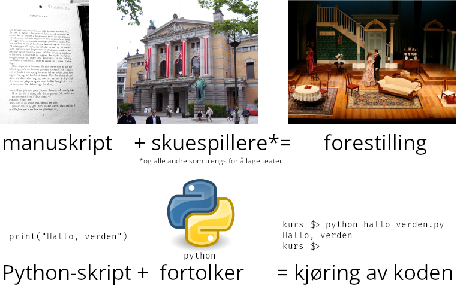

Kjøre Python-kode
=================
**💡 Læringsmål:** _I dette kapitlet skal du lære deg hvordan du får datamaskinen din til å kjøre Python-kode._

Når man lærer seg et programmeringsspåk, er ofte det første programmet man skrivet et [«Hallo, verden»-program](https://en.wikipedia.org/wiki/%22Hello,_World!%22_program). Dette er helt enkelt et program som skriver ut teksten «Hallo, verden». La oss skrive et sånt program sammen!


Hva er Python?
--------------

Python er et programmeringsspråk som fikk sin spede begynnelse i juleferien til nederlenderen Guido van Rossum i 1989.
Han publiserte prosjektet på internett (Usenet) i 1991, og det har siden blitt etablert en ideell stiftelse som videreutvikler og forvalter Python.
Guido van Rossum tok navnet fra et manuskript han leste i tida rundt da prosjektet startet, nemlig _Monty Python's Flying Circus_.

Språket er i dag mye brukt i introduksjonskurs i programmering.
Det er likevel ikke begrenset til lek og undervisning; Python er mye brukt innenfor områder som vitenskap, maskinlæring (KI), og nettsideutvikling.
I NRK brukes Python blant annet for diverse støttesystemer rundt planleggings- og rapporteringssystemet PRF, og til å styre transkodingsprosessene for podkast- og radio-lydfiler.

[Les mer om Python i Store norske leksikon](https://snl.no/Python_-_programmeringsspr%C3%A5k).


Python som programmeringsspråk
------------------------------

Når vi programmerer Python, lager vi vanligvis tekstfiler med instruksjoner skrevet i Python-programmeringsspråket.
Filene har filendelsen `.py`.
Språket følger en bestemt _syntaks_, som sier noe om hvordan gyldig Python-kode skal se ut, og en _semantikk_, som sier noe om hva datamaskinen skal gjøre når den kjører koden.

Python-kode kan skrives i et hvilket som helst program som produserer rene tekstfiler, som for eksempel Notepad/Notisblokk på Windows.
Vi anbefaler dog at du bruker et verktøy som er spesialdesignet for å skrive Python-kode, siden du får hjelp til å se hvordan koden blir tolket av datamaskinen.
[Introduksjonen til kurset](../README.md) har anbefalinger for deg som ikke har en kodeeditor fra før.


Python som dataprogram
----------------------

Python er _også_ navnet på et dataprogram, som formelt sett heter CPython.
CPython er en [_fortolker_](https://snl.no/fortolket_programmeringsspr%C3%A5k), på engelsk _interpreter_.
Fortolkere tolker tekstfiler med kode, og har ansvar for å bringe koden du skriver til live.
Når vi vil kjøre Python-kode, må vi altså starte en Python-fortolker, og be den om å tolke tekstfila vi har skrevet og utføre instruksjonene der.
Det finnes også andre fortolkere som kan tolke Python-koden vi skriver, men vi holder oss til CPython i dette kurset.

[I introduksjonen](../README.md) står det instruksjoner for hvordan du kan installere Python-fortolkeren.
Når det er installert, skal vi kunne starte det fra _terminalen_.


### Kjøre Python-fortolkeren i terminalen

Start en terminal som [Powershell på Windows](https://learn.microsoft.com/en-us/powershell/scripting/windows-powershell/starting-windows-powershell), [Terminal på Mac](https://support.apple.com/guide/terminal/open-or-quit-terminal-apd5265185d-f365-44cb-8b09-71a064a42125/mac) eller noe tilsvarende på Linux.
Du vil få et nesten tomt vindu med en blinkende markør.
Terminalen venter på at du skal skrive en kommando som den skal kjøre.

I hele dette kurset skal vi starte Python-fortolkeren fra terminalen.
Men nøyaktig _hva_ fortolkeren heter, kommer an på hvilket operativsystem du bruker, og hvordan du har installert Python.

| OS      | Installasjonsmåte | Navnet på Python-fortolkeren |
|---------|-------------------|------------------------------|
| Windows | Python.org        | `py`                         |
| Windows | Filewave          | `python`                     |
| Windows | Windows Store     | `python`                     |
| Linux   | Pakkebehandler    | `python3`                    |
| MacOS   | Python.org        | `python3`                    |

**Merk: I alle eksemplene kommer vi til å kalle fortolkeren for `python`, men det bytter du bare ut med riktig navn når du kjører kommandoer hos deg.**

La oss teste at Python er installert ved å skrive `python --version` i terminalen og trykke `[ENTER]`:

```shell
$> python --version
Python 3.10.2
```

Funker det ikke? Se neste seksjon for vanlige problemer og løsninger.

Du vil sannsynligvis få en annen versjon hos deg, men så lenge den er nyere enn eller lik 3.8 skal alle delene av kurset fungere.


### Mulige feil og løsninger når du kjører Python i terminalen

<details>
<summary>❌ Når jeg kjører <code>python --version</code> får jeg til svar <code>Python 2.7</code> eller en annen gammel variant</summary>

Prøv å kjøre `python3` i stedet for `python`:

```shell
$> python3 --version
Python 3.10.12
```

</details>
    
<details>
<summary>❌ Jeg får feilmelding <code>Python ble ikke funnet; kj°r uten argumenter for Õ installere fra Microsoft Store, eller deaktiver denne snarveien fra Innstillinger &gt; Administrer app utf°relses aliaser</code>.</summary>

Har du installert fra Python.org? Prøv å kjøre med `py` i stedet for `python`:

```shell
$> py --version
Python 3.11.5
```
</details>

<details>
<summary>❌ Jeg får feilmelding <code>NameError: name 'python' is not defined</code></summary>

Starter skrivelinja i terminalen med `>>>`?
Da er du allerede inne i en interaktiv Python-sesjon.
Hvis du vil tre ut av den skriver du `exit()` og trykker `[ENTER]` – da kommer du tilbake til utgangspunktet og kan kjøre kommandoer igjen.

</details>

<details>
<summary>❌ Jeg får feilmelding <code>python: command not found</code> eller <code>python: The term 'python' is not recognized as a cmdlet, …</code></summary>

* Prøv med andre varianter, som `py` eller `python3`
* Er du sikker på at du har installert Python?
* Det kan hende Python ligger i ei mappe som terminalen ikke er satt opp til å søke i.
  Prøv å installere på nytt, men huke av for valg om å legge til Python i "PATH".

</details>

<details>
<summary>❌ Jeg får feilmelding fra <code>py</code> om at <code>No suitable Python runtime found</code></summary>

* På Windows blir Python-installasjonen vanligvis installert personlig.
  Åpnet du terminalen med den samme brukeren som du installerte Python med?
* Du kan eventuelt installere Python på nytt, men velge «Customize install» – da kan du velge å installere Python for alle brukerne på maskinen, og ikke bare din egen.
* Du kan også få denne feilmeldingen hvis du har installert fra Python.org, men seinere fjernet Python-installasjonen.
  Da kan `py` bli liggende igjen, men uten at den har noen Python-fortolker å bruke.
  Prøv å installere på nytt.

</details>


Interaktiv Python: Test ut ting rett i terminalen
-------------------------------------------------

Fikk du kjørt `python --version` (eller `python3 --version` eller `py --version`) ovenfor?
Da er vi i så fall klare til å starte Python-fortolkeren _interaktivt_.

I interaktiv modus skriver du én Python-linje om gangen.
Python-fortolkeren kjører koden, og skriver resultatet tilbake til deg i terminalen.

For å starte Python-fortolkeren i interaktiv modus, skriver du bare `python` (eller `python3` eller `py`) uten noe etter:

```
$> python
Python 3.10.12 (main, Jun  7 2023, 12:45:35) [GCC 9.4.0] on linux
Type "help", "copyright", "credits" or "license" for more information.
>>>
```

Du kan se at Python-fortolkeren venter på at du skal skrive din første Python-linje.
Du kan se det på grunn av de tre «større enn»-tegnene, `>>>`.

La oss prøve ut litt Python-kode!
Skriv inn `print("Hallo, verden")` og trykk `[ENTER]`.
Hva skjedde?

<details>
<summary>Resultatet av <code>print("Hallo, verden")</code></summary>

```
$> python
Python 3.10.12 (main, Jun  7 2023, 12:45:35) [GCC 9.4.0] on linux
Type "help", "copyright", "credits" or "license" for more information.
>>> print("Hallo, verden")
Hallo, verden
>>>
```

</details>

Du kan også regne ut mattestykker!
Prøv for eksempel å skrive `6 * 7` og trykke `[ENTER]`.

<details>
<summary>Resultatet av <code>6 * 7</code></summary>

```
>>> 6 * 7
42
>>> 
```

</details>

Du kan se over [ekstra-delen om interaktiv Python](../ekstra/idle.md) litt seinere i kurset hvis du er nysgjerrig på andre ting du kan gjøre med interaktiv Python.


### Forlate interaktiv Python

For å avslutte Python-fortolkeren skriver du `exit()` etterfulgt av `[ENTER]`:

```
>>> exit()
$> 
```

Nå har `python`-kommandoen vi starta kjørt ferdig, og vi er tilbake til utgangspunktet.
Herfra kan vi kjøre andre kommandoer, eller vi kan kjøre `python` igjen.


Filer og mapper
---------------

Interaktiv Python er bra for eksperimentering og lek, men til daglig er det best å skrive koden inn i en fil.
Da er det mye lettere å gjøre små justeringer og kjøre koden på nytt igjen, spesielt når du får logikk som går over mer enn én linje.

Filer bor i mapper, og det kan være nyttig å lage en mappe som inneholder alle filene du skal lage i dette kurset. Vi kommer til å bruke en mappe som heter `kurs/` i denne kursbeskrivelsen. I denne mappen kan du lage en fil som heter `hallo_verden.py`. Når du har gjort det, kan du åpne filen i VS Code, og legge inn koden som er vist under:

```python
print("Hallo, verden")
```

Når du har lagt inn koden i filen, lagrer du den og starter en terminal som [Powershell på Windows](https://learn.microsoft.com/en-us/powershell/scripting/windows-powershell/starting-windows-powershell), [Terminal på Mac](https://support.apple.com/guide/terminal/open-or-quit-terminal-apd5265185d-f365-44cb-8b09-71a064a42125/mac) eller noe tilsvarende på Linux.

I den åpne terminalen, navigerer du ned i `kurs/`-mappen med f.eks. kommandoen `cd`.

```shell
$> cd kurs/
kurs $>
```

_Det kan være du må navigere lenger enn bare rett ned i `kurs/`-mappen på din maskin. Dette er avhengig av hvilken mappe terminalen åpnet seg i. For å gå ut av en mappe kan man bruke kommandoen `cd ..`. Avhengig av hvilket operativsystem du bruker, kan det også være mulig å åpne terminalen direkte i `kurs/`-mappen, fra filutforskeren._

Da skal vi kjøre Python-koden! Dette gjør du helt enkelt ved å kjøre kommandoen `python` etterfulgt av et mellomrom og navnet på Python-fila:

```shell
kurs $> python hallo_verden.py
Hallo, verden
```

Gratulerer! Du har nå kjørt ditt første _Python-skript_.

❌ _Får du feil? Sjekk [listen over vanlige feil ovenfor](#mulige-feil-og-løsninger-når-du-kjører-python-i-terminalen). Du må for eksempel gå ut av interaktiv Python før du får kjørt Python-skript._


### Hva er et Python-skript?

En `.py`-fil, ofte kalt _et Python-skript_, er en fil som inneholder Python-kode.
Disse skriptene får ikke til å gjøre noe med datamaskinen din på egenhånd; de er fullstendig avhengige av at Python-fortolkeren leser dem og utfører instruksjonene i dem.

Begrepet _skript_ stammer fra _manuskript_, og du kan sammenlikne Python-skript med manuskript som skuespillere fremfører på scenen.
Manuskriptet alene er ikke nok til å utgjøre en forestilling; det er først når du kombinerer manuskriptet med skuespillere, rekvisitører, teknikere og alle rundt at du får en forestilling.


_([Foto av Nationaltheatret](https://commons.wikimedia.org/wiki/File:Oslo_Nationaltheatret.JPG) av Chris Nyborg. [Foto av «Et dukkehjem»-forestilling](https://commons.wikimedia.org/wiki/File:A_Doll%27s_House_(6940143217).jpg) av Otterbein University Theatre & Dance. [Python-logo](https://commons.wikimedia.org/wiki/File:Python.svg) av Tango-prosjektet.
Alle tre er lisensiert under [Creative Commons BY-SA](https://creativecommons.org/licenses/by-sa/3.0/deed.en). Denne montasjen er satt sammen av Thorben Werner Sjøstrøm Dahl og er lisensiert under [Creative Commons BY-SA 3.0](https://creativecommons.org/licenses/by-sa/3.0/deed.en).)_

Selve Python-språket er det samme, uansett om du kjører Python-fortolkeren interaktivt i terminalen eller du skriver koden i et skript som du ber fortolkeren om å tolke.
Du _kan_ i teorien sitte og ta én og én linje fra et Python-skript og fôre dem til en interaktiv Python-sesjon, og resultatet vil bli nøyaktig det samme.

**NB**: I dette kapitlet har vi brukt begrepet _Python-fortolker_ om dataprogrammet som tolker og kjører Python-koden den blir gitt, og _Python-skript_ om `.py`-filene som inneholder Python-kode.
I resten av kurset kan vi finne på å si at «Vi lager et program som skal lese en tekstfil», og bruker «program» og «(Python-)skript» om hverandre.
Når vi bare snakker om «Python» kan vi referere til språket eller til Python-fortolkeren.

Oppsummert:

| Fagterm            | Engelsk                | Forklaring                                   | Kalles også                           |
|--------------------|------------------------|----------------------------------------------|---------------------------------------|
| Python-fortolkeren | the Python interpreter | Dataprogram som tolker og kjører Python-kode | Python, CPython                       |
| et Python-skript   | a Python script        | `.py`-filer som inneholder Python-kode       | et skript, et program, en applikasjon |


Sånn printer du til terminalen
------------------------------
I programmet over brukte vi funksjonen `print(...)` for å få Python-fortolkeren til å skrive tekst til terminalen.
Dette er ofte den enkleste måten å vise frem data på.
Man kan få Python-fortolkeren til å skrive tekst til terminalen med `print(...)` stort sett hvor som helst i et Python-skript, så denne funksjonen kan være nyttig i mange sammenhenger.

`print(...)` er et eksempel på en innebygget funksjon i Python. Funksjoner skal vi lære mer om senere i kurset, blant annet hvordan du kan lage dine egne funksjoner, men nå i første omgang kan vi notere oss tre ting:
1. Funksjonen har ett navn, `print`, og dette navnet står først, sånn at Python-fortolkeren forstår hvilken funksjon vi ønsker å bruke.
2. Parentesene etter funksjonsnavnet, står rundt teksten vi sender inn til funksjonen, sånn at Python-fortolkeren vet hvilken tekst vi ønsker å skrive til terminalen.
3. Selve teksten er skrevet med anførselstegn (`"`). Dette forteller fortolkeren at det her er snakk om tekst, og ikke mer programkode.

✍️ **Oppgave:** _Kan du utvide `hallo_verden.py`-skriptet, sånn at det printer ut en tekst til?_
