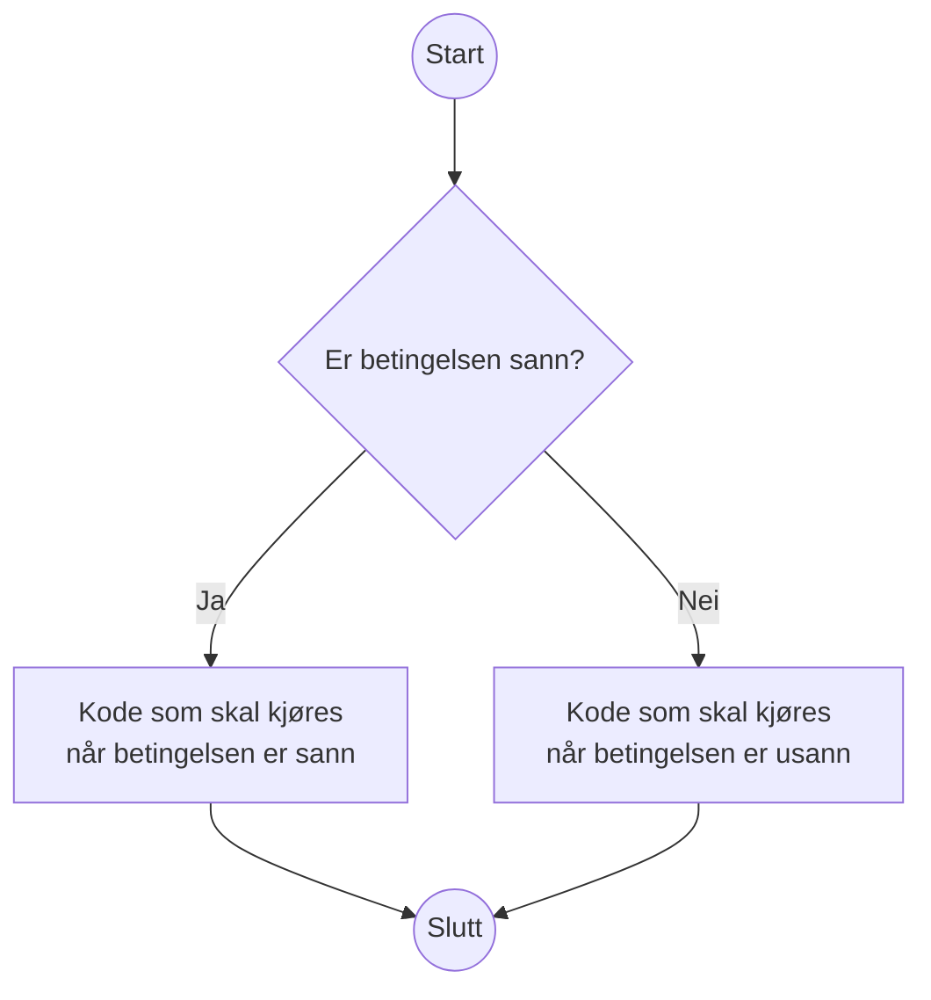
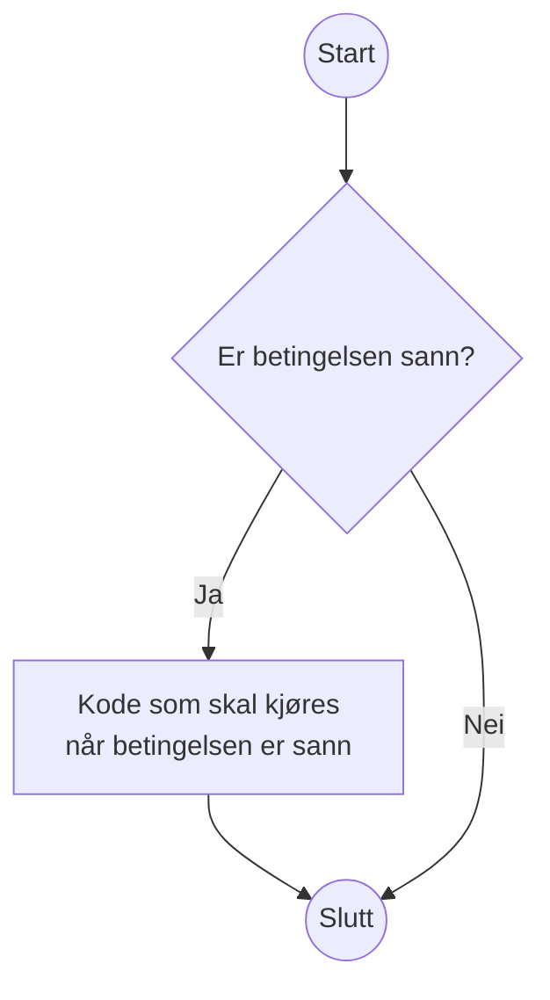
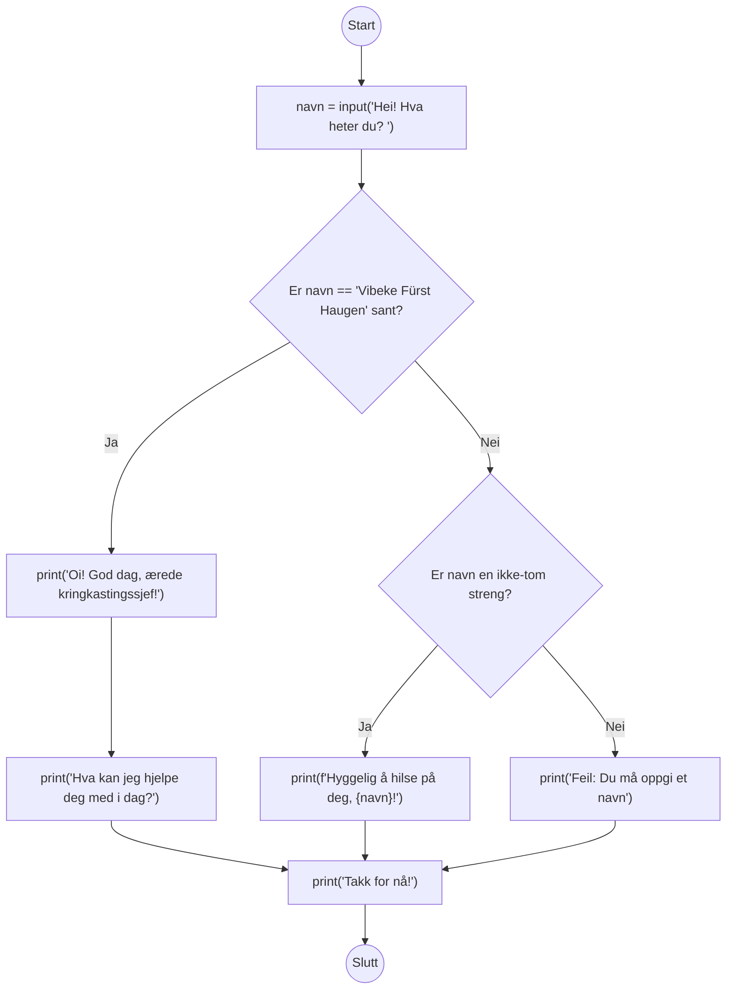

Hvis, omatte og ellers
======================

**💡 Læringsmål:** _I dette avsnittet skal du lære deg å skrive kode som gjør valg._

Hittil har programmene våre kjørt fra topp til bunn:
Så snart det har gjort seg ferdig med én instruks,
har programmet fortsatt med neste.
Det øyeblikket du begynner å få spesialtilfeller som skal behandles på forskjellige måter,
får du behov for å variere hva koden gjør.

De aller fleste programmeringsspråk har det som kalles for betingelser (conditionals).
De kan sammenliknes med flytdiagram som du kanskje har støtt på i andre tilfeller:



Her er en illustrasjon på hvordan betingelser ser ut i Python:

```python
# illustrasjon_if_else.py
print("Start")
if 2 + 2 == 4:
    print("Denne koden kjøres hvis betingelsen er sann")
    print("Du kan ha flere kodelinjer")
else:
    print("Denne koden kjøres hvis betingelsen er usann")
    
    print("Du kan ha flere kodelinjer her også")
print("Slutt")
```

Eksempel på kjøring:

```shell-session
kurs $> python illustrasjon_if_else.py
Start
Denne koden kjøres hvis betingelsen er sann
Du kan ha flere kodelinjer
Slutt
```

Hvordan klarer Python å skille mellom koden som skal kjøre avhengig av betingelsen,
og resten av koden?
Svaret er _kodeblokker_.
Ei kodeblokk er ei samling med kode som hører sammen og blir eksekvert sammen.
I Python bruker vi et kolon på slutten av ei linje til å indikere at «her kommer ei kodeblokk!».
Hver linje som inngår i kodeblokken må ha et større innrykk enn koden rundt, for eksempel fire mellomrom.
Den første linja som har mindre innrykk avslutter kodeblokken og vil ikke inngå i den.
(Blanke linjer er tillatt.)

## Innrykk er viktig i Python

Du vil som oftest få hjelp av editoren din,
for eksempel vil den legge på innrykk når du skriver `if:[ENTER]`.
Utenom automatikken kan du som oftest bruke `[TAB]`-tasten til å lage et passelig stort innrykk,
men husk på at en tabulator er noe annet enn et mellomrom.
Mange editorer vil sette inn mellomrom når du trykker `[TAB]`
i stedet for å sette inn et tabulator-tegn,
men hvis den ikke gjør det og du blander tabulator med mellomrom får du trøbbel:

```python
# feil_innrykk.py
if 2 + 2 == 4:
        print("Hei")
	print("Hallo")
```

Du kan ikke se det med det blotte øye,
men her har vi brukt mellomrom på «Hei» og tabulator på «Hallo».
Prøver du å kjøre dette, får du feil:

```shell-session
kurs $> python feil_innrykk.py
  File "/home/n123456/kurs/feil_innrykk.py", line 3
    print("Hallo")
TabError: inconsistent use of tabs and spaces in indentation
```
Det finnes en måte du kan åpne opp øynene dine for ulike typer mellomrom.
I Visual Studio Code kan du velge View, Appearance og Render Whitespace.
Vanlig mellomrom blir vist som prikker,
mens en tabulator blir vist som ei pil.
Feilen ovenfor løser du ved å bare bruke det ene eller det andre,
aldri en blanding.

I Visual Studio Code kan du velge hva slags innrykk den skal bruke.
Du må se nederst til høyre i vinduet, der hvor det står «Ln #, Col #» (med tall i stedet for #).
Dette er linja og kolonna markøren din står i.
Etter denne står det hva slags innrykk editoren bruker, for eksempel «Spaces: 4».
Trykk på denne for å endre typen innrykk og størrelsen på innrykket.

Det er utkjempet kriger på internett over hva som er riktig av mellomrom og tabulator,
så vi nøyer oss med å si at mellomrom gjør at koden ser lik ut for alle,
mens tabulator lar ulike personer justere hvor mange «mellomrom» en tabulator skal tilsvare visuelt.
Det viktigste er at du bruker én av de konsekvent i hele prosjektet;
hvilken du bruker er underordnet.

## Du kan droppe `else`

Noen ganger har du ikke noe du vil gjøre i `else`.
Da kan du bare droppe den, og ha en `if` med tilhørende kodeblokk.

Som flytdiagram:



Som Python-kode:

```python
# illustrasjon_if.py
print("Start")
if 2 + 2 == 5:
    print("Denne koden kjøres hvis betingelsen er sann")
    print("Du kan ha flere kodelinjer")
print("Slutt")
```

Eksempel på kjøring:

```shell-session
kurs $> python illustrasjon_if.py
Start
Slutt
```


## Eksempel: Hilsen

Vi kan bygge videre på hilsenen vi lagde oss i forrige seksjon.
Klarer vi å reagere på det brukeren skriver?

```python
# hilsen_med_if.py
navn = input("Hei! Hva heter du? ")
if navn == "Vibeke Fürst Haugen":
    print("Oi! God dag, ærede kringkastingssjef!")
    print("Hva kan jeg hjelpe deg med i dag?")
else:
    if navn:
        print(f"Hyggelig å hilse på deg, {navn}!")
    else:
        print("Feil: Du må oppgi et navn")
print("Takk for nå!")
```

Her har vi brukt `if` og `else` inni `else`.
Det går helt fint an å kombinere dem på denne måten,
i så mange lag bortover som du ønsker.
Hvor praktisk det blir, er et annet spørsmål...

Eksempel på kjøring:

```shell-session
kurs $> python hilsen_med_if.py
Hei! Hva heter du? Vibeke Fürst Haugen
Oi! God dag, ærede kringkastingssjef!
Hva kan jeg hjelpe deg med i dag?
Takk for nå!
kurs $> python hilsen_med_if.py
Hei! Hva heter du? 
Feil: Du må oppgi et navn
Takk for nå!
kurs $> python hilsen_med_if.py
Hei! Hva heter du? Thorben
Hyggelig å hilse på deg, Thorben!
Takk for nå!
```

Hvordan ville dette sett ut som flytdiagram?



## Snarvei: Kombinere `else` og `if`

Python har en snarvei du kan bruke til å kombinere `else` og `if`.
Denne snarveien heter selvfølgelig `elif`.

I forrige seksjon hadde vi en `if` inne i kodeblokken som hørte til en `else`.
Det går kanskje greit når du bare har én sånn if/else-struktur inni i en annen,
men du får fort en veldig lang venstremargin når du får tre eller flere spesialtilfeller.

For å konvertere det forrige eksemplet til å bruke `elif`,
kan du trekke sammen `else:` med `if:` og
redusere innrykket med ett hakk:

```python
# hilsen_med_elif.py
navn = input("Hei! Hva heter du? ")
if navn == "Vibeke Fürst Haugen":
    print("Oi! God dag, ærede kringkastingssjef!")
    print("Hva kan jeg hjelpe deg med i dag?")
elif navn:
    print(f"Hyggelig å hilse på deg, {navn}!")
else:
    print("Feil: Du må oppgi et navn")
print("Takk for nå!")
```

Koden oppfører seg helt likt som før,
den har bare blitt litt lettere å forholde seg til.


## Eksempel: Avslutte programmet tidlig

Nå som vi kan gjøre forskjellige ting avhengig av hva brukeren skriver,
kan vi også få til å gjøre noe bare hvis brukeren ønsker det.
For eksempel kan vi avslutte programmet vårt tidlig
hvis brukeren ikke ønsker å fortsette.

For å få til å avslutte programmet tidlig, må vi _importere_ en modul, i tilfellet her `sys`.
Ved å importere `sys` får vi tilgang til alle funksjonene som ligger i [`sys`-modulen][doc-sys].
En av disse funksjonene er [`sys.exit()`][doc-sys.exit], som kan brukes til å avslutte programmet.
Hvis du sender en streng inn til `sys.exit(arg)` vil strengen printes til konsoll,
før programmet avsluttes med feilkode `1`.

```python
# prompt_fortsett.py
import sys

print("La oss late som at programmet ønsker å slette ei fil.")
vil_fortsette = input("Vil du fortsette (y/N)? ").lower()[:1] == "y"
if not vil_fortsette:
    sys.exit("Avslutter...")
print("Sletter fila...")
```

Her har du et eksempel på `if` uten `elif` eller `else`.
Vanligvis ville programmet ha fortsatt til linja `print("Sletter fila...")` uansett,
men `sys.exit` setter en stopper for det.
En mer naiv løsning hadde vært:

```python
if vil_fortsette:
    print("Sletter fila...")
else:
    print("Avslutter")
```

Svakheten med dette alternativet er at det blir uoversiktlig hvis det er
hundrevis av ting som må gjøres mellom `if` og `else`.
Da blir det ryddigere hvis du heller bare rydder ut av veien tilfellet hvor brukeren vil avbryte,
og kan skrive resten av programmet uten innrykk.
Dette er en vanlig teknikk for å unngå at det blir for mange innrykk til slutt.
Du kan se for deg hvor langt inn du måtte ha rykket koden hvis du skulle spurt om
brukeren vil fortsette et par-tre ganger til.

Eksempel på kjøring:

```shell-session
kurs $> python prompt_fortsett.py
La oss late som at programmet ønsker å slette ei fil.
Vil du fortsette (y/N)? 
Avslutter...
kurs $> python prompt_fortsett.py
La oss late som at programmet ønsker å slette ei fil.
Vil du fortsette (y/N)? yes
Sletter fila...
```

## Eksempel: Bruke forvalgt verdi for input()

Si at du vil ha tak i brukerens navn,
men vil falle tilbake på brukernavnet hvis brukeren ikke skriver noe.
Da kan du _først_ lage en variabel med navnet du vil falle tilbake på,
og så spørre brukeren om navnet.
Hvis brukeren oppga et navn kan vi overskrive variabelen som vi allerede skrev et navn til,
men hvis brukeren ikke oppga noenting, kan vi bare la variabelen være som den er.

For å hente brukernavnet til den innloggede brukeren,
kan vi importere [modulen `getpass`][doc-getpass].
Den har [en funksjon kalt `getpass.getuser()`][doc-getpass.getuser] som forsøker å hente brukernavnet fra systemet.

```python
import getpass

# Bruk brukernavnet som forvalg
navn = getpass.getuser()

oppgitt_navn = input(f"Navn: [{navn}] ").strip()
if oppgitt_navn:
    navn = oppgitt_navn

print(f"Hei, {navn}")
```

En fordel med denne løsninga er at du kan stole på at `navn` har en verdi,
uansett hva brukeren gjør.

PS: Her brukte vi [`str.strip()`][doc-str.strip] til å fjerne mellomrom fra starten og slutten på strengen.
En bieffekt av dette er at du vil få en tom streng, selv hvis du skriver inn mange mellomrom.
På den måten får vi falt tilbake til brukernavnet i tilfellet hvor vi ellers ville brukt strengen
(siden betingelsen `if oppgitt_navn` ville vært oppfylt når `oppgitt_navn == "    "`, med andre ord en ikke-tom streng).


## Tilegne ulik verdi basert på boolsk uttrykk

Det finnes en snarvei du kan bruke alle de gangene du har en variabel som enten skal være det ene eller det andre.
For eksempel når du vil bruke riktig av entall og flertall,
og ikke vet på forhånd hvor mange det er snakk om.

Formatet er:

```python
<verdi hvis sann> if <betingelse> else <verdi hvis usann>
```

Du kan selvfølgelig skrive noe sånt som «Endret 3 fil(er)» og ta høyde for entall og flertall på den måten.
Men du kan også velge å være perfeksjonist:

```python
# entall_flertall.py
antall_filer = int(input("Hvor mange filer vil du endre? "))

# Vi endrer ingenting, det er bare på liksom
fil_substantiv = "fil" if antall_filer == 1 else "filer"
print(f"Endret {antall_filer} {fil_substantiv}")
```

Eksempel på kjøring:

```shell-session
kode $> python entall_flertall.py
Hvor mange filer vil du endre? 9000
Endret 9000 filer
kode $> python entall_flertall.py
Hvor mange filer vil du endre? 1
Endret 1 fil
```

[doc-sys]: https://docs.python.org/3/library/sys.html
[doc-sys.exit]: https://docs.python.org/3/library/sys.html#sys.exit
[doc-getpass]: https://docs.python.org/3/library/getpass.html
[doc-getpass.getuser]: https://docs.python.org/3/library/getpass.html#getpass.getuser
[doc-str.strip]: https://docs.python.org/3/library/stdtypes.html#str.strip
