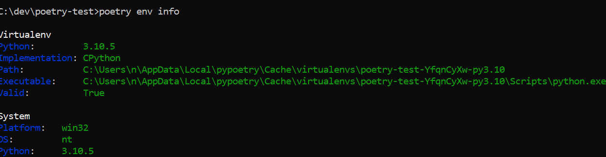
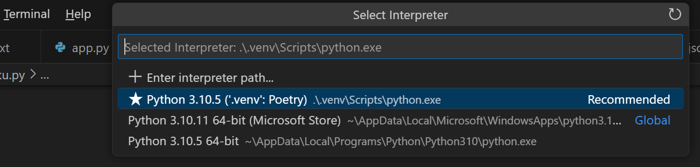
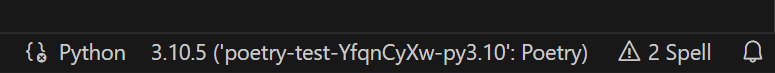

Pakkebehandler og pip
=====================

_Hvorfor skrive egen kode når du kan bruke andres? Velkommen til jungelen av bibliotekspakker!_

## Åpen kildekode

Når vi programmerer, ender vi ofte opp med å løse problemer som allerede har blitt løst av andre programmerer mange ganger før.
For eksempel det å gjøre nettverkskall til en server,
tolke et spesielt filformat,
ta i mot nettverkskall fra nettlesere med mer.
I stedet for at du må løse dette «ferdig løste» problemet enda en gang,
kan du gjenbruke løsninger som andre har skrevet før deg.


### Opphavsretten setter begrensninger

I utgangspunktet er all koden som du finner på nettet underlagt opphavsretten.
Den begrenser deg sånn at du ikke får lov til å kopiere og gjenbruke andres kode uten tillatelse,
på samme måte som du ikke kan skrive avskrift av ei bok du har kjøpt.
Du kan dog inngå en avtale med forfatteren som slår fast at du har lov til å bruke koden.


### Lisenser: Avtaler som gir deg lov til å bruke kode

Kode som er publisert på nettet for å gjenbrukes, blir som regel gjort tilgjengelig under en _«åpen kildekode»-lisens_.
En _lisens_ er en avtale som du kan velge å følge for å få visse rettigheter under bestemte vilkår,
uten at du må kontakte forfatteren, besøke et advokatkontor og signere en avtale i tre eksemplarer.
Lisenser for «åpen kildekode» vil som regel gi deg rett til å gjenbruke kildekoden,
men bare på visse betingelser.
Hvis du bryter med betingelsene så har du ikke lenger rett til å bruke koden.


### Ulike lisenser og deres bruksvilkår

De aller fleste lisensene har betingelser som er helt greie å oppfylle.
Men du bør være obs på at det finnes _copyleft_-lisenser som stiller krav til at også _din_ kode må være lisensiert med den samme lisensen.
Disse lisensene sørger for at en bedrift ikke bare kan nyttiggjøre seg av koden uten å donere forbedringene tilbake til fellesskapet.
Motsatt finnes _permissive_-lisenser som nesten ikke stiller noen krav i det hele tatt.

Nettstedet https://choosealicense.com/ gir en fin introduksjon til hvilken lisens du bør velge hvis du selv ønsker å dele kildekoden din.
På undersiden https://choosealicense.com/appendix/ kan du slå opp lisenser som du finner der ute på nettet,
for å få oversikt over hvilke rettigheter de gir deg og
hvilke betingelser som følger med.


### Åpen kildekode på internett

På nettet kan du finne mye åpen kildekode på nettsteder som [GitHub.com](https://github.com).
Du kan kopiere kode fra prosjekter du finner der og bruke den i ditt eget prosjekt,
så lenge koden er lisensiert med en «åpen kildekode»-lisens og du oppfyller lisensens betingelser.
Lisensen ligger som regel i ei fil som heter `LICENSE` eller `LICENSE.txt`
i den øverste mappa i prosjektet,
eller den er nevnt øverst i hver enkelt kodefil.
[Hvis du ikke finner noen lisens][no-license] så må du bare anta at koden ikke er åpen kildekode.

[no-license]: https://choosealicense.com/no-permission/


### Åpen kildekode er frivillighetsarbeid

Åpen kildekode utvikles i fellesskap.
Hvis du finner en feil eller har forslag til forbedring,
kan du som oftest melde dette på prosjektets nettside.
Du kan også foreslå endringer i koden og bidra som frivillig.

Det er dessverre et problem i dette økosystemet med at vi har veldig viktige åpne programvarer
som store bedrifter har gjort seg helt avhengige av å bruke,
som sliter med å holde programvaren oppdatert og fri for feil fordi alle er veldig glade i å bruke koden,
men ingen er villige til å legge ned tid og krefter i å vedlikeholde den.
Som poengert av XKCD:

[](https://xkcd.com/2347/)


## Pakker

Det å kopiere kode fra andres prosjekter inn i ditt prosjekt har noen svakheter:

* Du får ikke med oppdateringer som blir gjort på koden du kopierte fra,
  for eksempel hvis det var en viktig sikkerhetsfeil som ble fikset.
* Koden du kopierer fra kan gjenbruke andres kode i tur,
  som gjør at du potensielt må kopiere inn den koden, og så videre.

Å la deg inspirere av andres åpne kildekode eller kopiere én funksjon eller noen få kodelinjer pleier å gå greit,
men det øyeblikket du vil gjenbruke mer så bør du gjøre det i mer ordna former.

For å gjøre det lettere å gjenbruke andres kode, organiserer vi gjenbrukbar kode i _pakker_.
Ei pakke har et pakkenavn og kan også ha flere versjoner,
der hver versjon er identifisert med et versjonsnummer.
Ei pakke består av ei samling med kodefiler som er pakket sammen i én fil.
Disse pakkene kan installeres, litt på samme måte som du installerer et dataprogram på maskinen din.
Hver pakke kan også ha _avhengigheter_ (dependencies) til andre pakker,
som må installeres for at pakken skal fungere.

For å installere, avinstallere og holde styr på installerte pakker bruker vi en _pakkebehandler_.
I Python er det en innebygd pakkebehandler ved navn [pip],
men den har ikke noen god innebygd funksjonalitet for å holde styr på hvilke pakker prosjektet ditt krever er installert.
Vi skal derfor bruke en pakkebehandler som heter [Poetry].

[pip]: https://packaging.python.org/en/latest/tutorials/installing-packages/#use-pip-for-installing
[Poetry]: https://python-poetry.org/


## Installere Poetry

Poetry har et eget Python-skript du kan kjøre for å installere det.
Følg [installasjonsveiledningen til Poetry](https://python-poetry.org/docs/#installation).

Når du har installert Poetry, skal du kunne kjøre `poetry --version` i terminalen.

```shell
kurs $> poetry --version
Poetry (version 1.3.1)
```

Din versjon vil sannsynligvis være nyere enn 1.3.1 som er vist ovenfor, men det gjør ingenting.


## Sette opp Python-prosjektet ditt

Før du kan begynne å installere pakker, må du sette opp et _Python-prosjekt_.
Et Python-prosjekt er ei mappe med Python-filer som utgjør en logisk enhet.
[EPG-innleseren fra del 2](../kap2/5_oppgave.md) er et typisk eksempel på et Python-prosjekt,
og hvis du skulle lagd en tale-til-tekst-tjeneste så ville den vært et annet Python-prosjekt.

Alle Python-filene i et Python-prosjekt deler de samme avhengighetene.

For hvert Python-prosjekt hører det til ei `pyproject.toml`-fil.
Den inneholder informasjon om prosjektet, hvilken Python-versjon prosjektet krever,
og hvilke pakker som må installeres for at prosjektet kan kjøres.

Bruk Poetry til å lage denne fila for deg med hjelp av `poetry init`:

```shell
kurs $> poetry init

This command will guide you through creating your pyproject.toml config.

Package name [kurs]:  epg-innleser
Version [0.1.0]:  1.0.0
Description []:  Analyseverktøy for EPG
Author [Kari Nordmann <kari.nordmann@nrk.no>, n to skip]:
License []:
Compatible Python versions [^3.8]:

Would you like to define your main dependencies interactively? (yes/no) [yes] no
Would you like to define your development dependencies interactively? (yes/no) [yes] no
Generated file

[tool.poetry]
name = "epg-innleser"
version = "1.0.0"
description = "Analyseverktøy for EPG"
authors = ["Kari Nordmann <kari.nordmann@nrk.no>"]
readme = "README.md"
packages = [{include = "epg_innleser"}]

[tool.poetry.dependencies]
python = "^3.8"


[build-system]
requires = ["poetry-core"]
build-backend = "poetry.core.masonry.api"


Do you confirm generation? (yes/no) [yes]
```

Fordi vi bare har tenkt å bruke dette Python-prosjektet lokalt så spiller det ikke så stor rolle akkurat hva du putter i de ulike feltene.
Navn, versjon, beskrivelse, forfattere og lisens er dog veldig nyttig hvis du skal publisere prosjektet ditt som en pakke andre kan laste ned.


## Legge til avhengigheter

Vi bruker kommandoen `poetry add <pakkenavn...>` for å legge til en avhengighet.
Når vi gjør det, laster Poetry ned pakken fra en sentral pakkebrønn kalt "The Python Package Index" (PyPI)
som er drevet av "Python Software Foundation", som er de samme som vedlikeholder selve Python-språket.

Før du laster ned ei pakke, bør du søke den opp på https://pypi.org.
Der kan du lese hva pakken gjør, hvordan du bruker den og klikke deg inn på nettsida til prosjektet.

**Eksempel**: La oss legge til [cowsay] som en avhengighet.

```shell
kurs $> poetry add cowsay
Creating virtualenv epg-innleser-ZMuqz6FV-py3.8 in /home/n123456/.cache/pypoetry/virtualenvs
Using version ^5.0 for cowsay

Updating dependencies
Resolving dependencies... (7.4s)

Writing lock file

Package operations: 1 install, 0 updates, 0 removals

  • Installing cowsay (5.0)
kurs $>
```

[cowsay]: https://pypi.org/project/cowsay/


## Hvordan kjøre program med Poetry?

Avhengighetene som Poetry installerer for oss blir installert på en sånn måte at de hører til Python-prosjektet vårt.
Det betyr at du må gjøre et ekstra steg for å «tre inn i» Python-prosjektet, sånn at du kan få tak i de installerte pakkene.

Hvis du prøver å kjøre `cowsay`-pakken som vi installerte i stad, vil vi få en feil:

```shell
kurs $> python -m cowsay Dette er kuuuuult
/usr/bin/python: No module named cowsay
```

Du har to alternativer for å tre inn i Python-prosjektet:

* Kjør én kommando inni Python-prosjektet: `poetry run <kommando>`
* Åpne en terminalsesjon inni Python-prosjektet: `poetry shell`.
  Da kan du kjøre flere kommandoer uten å bruke `poetry run` foran.
  Når du er ferdig kjører du `exit`.

Eksempel på å kjøre én kommando med `poetry run`:

```shell
kurs $> poetry run python -m cowsay -t "Dette er kuuuuult"
  _________________
| Dette er kuuuuult |
  =================
                 \
                  \
                    ^__^
                    (oo)\_______
                    (__)\       )\/\
                        ||----w |
                        ||     ||
```

Eksempel på å kjøre flere kommandoer med `poetry shell`:

```shell
kurs $> poetry shell
Spawning shell within /home/n123456/.cache/pypoetry/virtualenvs/epg-innleser-ZMuqz6FV-py3.8
. /home/n123456/.cache/pypoetry/virtualenvs/epg-innleser-ZMuqz6FV-py3.8/bin/activate
(epg-innleser-py3.8) kurs $> python -m cowsay -t "Dette var litt møøøøe"
  _____________________
| Dette var litt møøøøe |
  =====================
                     \
                      \
                        ^__^
                        (oo)\_______
                        (__)\       )\/\
                            ||----w |
                            ||     ||
(epg-innleser-py3.8) kurs $> exit
exit
kurs $> 
```

## Hvordan bruke en pakke i Python-kode

Som oftest ønsker vi å bruke pakka vi har installert i et Python-program. En pakke kan gi både nye kjørbare program, importerbare moduler, eller begge deler. Vi skal se på hvordan vi kan bruke en importerbar modul fra en pakke.

Siden vi alt har `cowsay`-pakka installert, bruker vi denne i eksempelet. Vi starter med å få kua til å si det samme som fra terminalen. Lag en ny Python-fil innenfor samme mappe som prosjektfila `pyproject.toml`, og kopier inn linjene under. Den første linja med `import` er for at vi skal få tilgang til funksjonene i `cowsay`-modulen. Deretter kaller vi `cow`-funksjonen med teksten vi vil at kua skal si som parameter.

```python
import cowsay

cowsay.cow("Dette er kuuuuult")
```

For å kjøre programmet fra terminalen brukes `poetry` ganske likt som terminaleksempelet over.

```shell
poetry run python <filnavn>.py
```

### Få Poetry til å fungere med VS Code

Hvis vi fortsatt vil kjøre programmer fra VS Code ved å trykke på "play"-knappen, må vi fortelle VS Code hvilken Python-fortolker den nå skal bruke. Det er fordi Poetry lager en egen folder for prosjektet med en Python-fortolker og pakkene vi installerer.

For å finne stien til Python-fortolkeren til Poetry kan man kjøre følgende kommando i terminalen.

```shell
poetry env info
```
Det vil da listes opp miljøer tilsvarende bildet under. Kopier ut stien som er i `executable` under `virtualenv`.



For å sette Python-fortolker i VS Code, kan du gå til `View` i toppmenyen i VS Code, og deretter velge `Command Palette...`. Begynn å skrive `python: select interpreter` i kommandofeltet, og klikk på samme tekst når det kommer som valg i nedtrekkslista.

Da har du forhåpentligvis kommet til noe som ligner på bildet under, klikk på `Enter interpreter path`, og lim inn stien du kopierte fra terminalen.



Om du har valgt riktig fortolker bør det stå noe om `Poetry` i menylinja helt i bunnen av VS Code, ved siden av versjonsnummeret for Python. 



### Kjør programmet

Kjør programmet og se at kua dukker opp i terminalen! 

✍️ **Oppgave** Det finnes andre innebygde figurer enn ku, for eksempel `dragon`, `fox`, `octopus`, `stegosaurus` og `turtle`. Disse finnes også som funksjoner, så test å bytte ut kall til `cow()` i programmet med en av de andre figurene.

✍️ **Ekstraoppgave** `cowsay` har også funksjonen `draw()`, som i tillegg til tekst, lar deg sende inn en streng for figuren man vil skal tegnes under snakkebobla. For eksempel:

```python
fisk = r"""
\
 \  
        /`·.¸
     /¸...¸`:·
 ¸.·´  ¸   `·.¸.·´)
: © ):´;      ¸  {
 `·.¸ `·  ¸.·´\`·¸)
     `\\´´\¸.·´
"""
```

Bruk funksjonen `draw` for å få fisken til å snakke. Eller søk etter ascii art på nettet, [asciiart.eu](https://www.asciiart.eu/) er en nettside med mange små kunstverk i ascii. Eller kanskje du vil lage en figur helt selv?


## Andre ting du kan gjøre

Vi har sett på disse Poetry-kommandoene allerede:

* [`poetry init`][poetry-init]: Sett opp et Python-prosjekt fra scratch
* [`poetry add <pakkenavn>...`][poetry-add]: Legg til avhengighetene med pakkenavnene du har oppgitt
* [`poetry run <kommando>`][poetry-run]: Kjør én kommando inni prosjektet
* [`poetry shell`][poetry-shell]: Åpne en ny terminalsesjon inni prosjektet (for å kjøre flere kommandoer)

Her er et par andre Poetry-kommandoer du kan bruke:

* [`poetry install`][poetry-install]: Installer alle avhengighetene i `poetry.lock`.
  Nyttig hvis du har kopiert koden til en ny datamaskin og trenger å få på plass alle avhengighetene igjen.
* [`poetry remove <pakkenavn>...`][poetry-remove]: Fjern avhengighetene med pakkenavnene du har oppgitt
* [`poetry show <pakkenavn>`][poetry-show]: Vis informasjon om den installerte pakka med det angitte pakkenavnet
* [`poetry update`][poetry-update]: Oppdater avhengighetene
* [`poetry self update`][poetry-self-update]: Oppdater Poetry
* [`poetry list`][poetry-list]: List opp _alle_ Poetry-kommandoene som er tilgjengelige

[poetry-init]: https://python-poetry.org/docs/cli#init
[poetry-add]: https://python-poetry.org/docs/cli#add
[poetry-run]: https://python-poetry.org/docs/cli#run
[poetry-shell]: https://python-poetry.org/docs/cli#shell
[poetry-install]: https://python-poetry.org/docs/cli#install
[poetry-remove]: https://python-poetry.org/docs/cli#remove
[poetry-show]: https://python-poetry.org/docs/cli#show
[poetry-update]: https://python-poetry.org/docs/cli#update
[poetry-self-update]: https://python-poetry.org/docs/cli#self-update
[poetry-list]: https://python-poetry.org/docs/cli#list


## Videre lesning

* [Poetry sin dokumentasjon](https://python-poetry.org/docs/basic-usage/)
* [Introduksjon til den innebygde pakkebehandleren Pip](https://packaging.python.org/en/latest/tutorials/installing-packages/)
