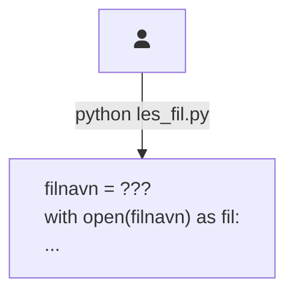
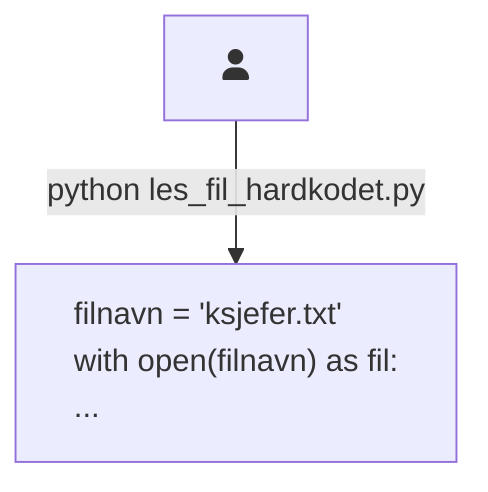
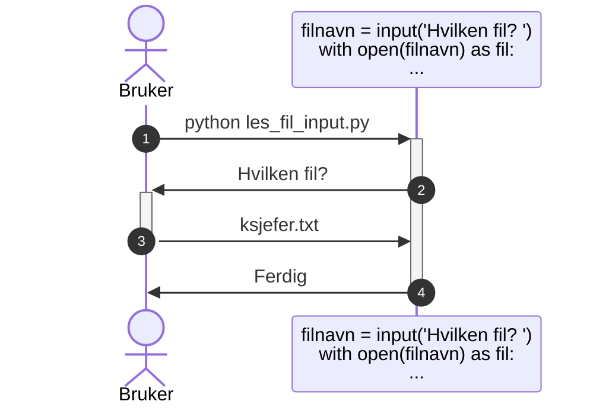
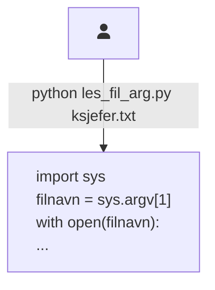

Programargumenter
=================

**💡 Læringsmål:**
_I dette kapitlet skal du bli kjent med hvordan du kan gi brukeren kontroll
over hva applikasjonen skal gjøre, uten at applikasjonen stopper opp underveis._

Når vi skriver kommandolinjeprogram for et visst publikum så må vi tenke på _brukeropplevelsen_ for de som bruker programmet vårt.
Nå tenker du sikkert at det gjør da ingenting, for det er bare du som skal bruke programmet du lager.
Men du risikerer selv å bli en nybegynner på programmet ditt når det har gått et år siden sist du brukte det,
og alle minner om hvordan det fungerte for lengst har forduftet.

Brukergrensesnittet til kommandolinjeprogram kalles _the command-line interface (CLI)_ på engelsk.
I dette kapitlet ser vi på ett av mange aspekter ved CLI.


## Hvordan kan du la brukeren bestemme ting?

Hvordan kan applikasjonen din vite hvilken fil den skal lese fra?
Eller hvilken fil den skal skrive til?
Eller hva den i det hele tatt skal gjøre med innholdet i fila?

Vi skal illustrere ulike alternativer vi har for å løse dette problemet.


### Eksempelfila `ksjefer.txt`

Før vi går i gang, kan du lage ei fil som heter `ksjefer.txt` med følgende innhold:

```
Olav Midttun
Kaare Fostervoll
Hans Jacob Ustvedt
Torolf Ester
Bjartmar Gjerde
Einar Førde
John G. Bernander
Hans-Tore Bjerkaas
Thor Gjermund Eriksen
Vibeke Fürst Haugen
```

Vi skal referere til denne fila når vi kjører eksempelprogrammet vi lager oss.


### Problemstillingen

Vi ser på et eksempel der vi skal åpne ei fil og skrive innholdet av fila til terminalen.
Hvordan skal programmet vite hvilken fil som skal åpnes?



Vi tar en kikk på ulike måter vi kan hente filnavnet på.


### Hardkode verdien i koden

Den enkleste løsningen er å bestemme alt dette inni applikasjonen, såkalt *[hardkoding][wiki-hardcoding]*.
For eksempel kan du skrive filstien direkte i koden.



Fullstendig kodeeksempel:

```python
# les_fil_hardkodet.py
filnavn = "ksjefer.txt"
with open(filnavn) as fil:
  for linje in fil:
    print(linje, end="")
```

Dette kan fungere helt greit når du tester,
men det blir fryktelig upraktisk å måtte endre programmet hver gang du vil lese ei ny fil.


### Spørre underveis med `input()`

I [del 1.4 av kurset](../kap1/4_input.md) var vi innom [`input()`-funksjonen][doc-input],
som lar deg stille brukeren et spørsmål som hen må svare på før programmet fortsetter.



Fullstendig kodeeksempel:

```python
# les_fil_input.py
filnavn = input("Hvilken fil? ")
with open(filnavn) as fil:
  for linje in fil:
    print(linje, end="")
```

Dette fungerer bra for interaktive applikasjoner der brukeren skal sitte parat ved tastaturet hele veien,
men det er ofte mye mer praktisk for brukeren å kunne bestemme alt dette helt i starten,
og så gjøre noe annet mens programmet kjører.


### Gi verdien samtidig som du starter programmet

I resten av dette kapitlet skal vi se på _programargumenter_.
Dette er verdier som brukeren skriver samtidig som hen starter programmet ditt.
For eksempel:



Vi kommer tilbake til koden om litt,
men kan du se hvor brukeren har skrevet filnavnet hen?

Frem til nå har vi alltid skrevet `python` etterfulgt av et mellomrom og navnet på programmet vi ville kjøre.
Men du kan alltids legge til flere argumenter _etter_ navnet på skriptet (her `les_fil_arg.py`).
Dette er argumenter til programmet ditt, som det kan lese ut og nyttiggjøre seg av.


#### Funksjons- eller programargument?

Du kjenner kanskje igjen ordet _argument_ fra funksjoner.
Hvis vi skulle skrevet dette som en Python-funksjon som tok inn filnavnet som et _funksjonsargument_, ville det kanskje sett sånn her ut:

```python
# les_fil_func.py
def les_fil(filnavn):
  with open(filnavn) as fil:
    for linje in fil:
      print(linje, end="")

les_fil("ksjefer.txt")
```

Funksjons- og programargumenter handler begge to om å sende informasjon inn til koden.
Forskjellen ligger i om det er en _funksjon_ eller om det er _hele programmet_ som er mottaker.


## Lese programargumenter manuelt

La oss starte med den innebygde måten du kan lese argumenter på.

For å nyttiggjøre deg av de ekstra argumentene brukeren skriver,
kan du importere [`sys`-modulen][doc-sys].
Deretter kan du lese argumentene fra [lista `sys.argv`][doc-sys.argv].

Lista i `sys.argv` har alltid navnet på skriptet i posisjon 0.
Eventuelle programargumenter ligger i posisjon 1 og utover.


### Skrive `sys.argv` til terminalen

Er det litt forvirrende hvordan det du skriver i terminalen blir gjort om til `sys.argv` i Python?
Vi kan lage oss et program som lar oss se hvordan `sys.argv` ser ut, og eksperimentere med det:

```python
# print_argv.py
import sys

print(sys.argv)
```

✍️ **Oppgave:**
_Lag `print_argv.py` lokalt hos deg, og eksperimenter med å kjøre det i terminalen.
Hva printes når du ikke oppgir noe programargument?
Hva printes når du gir mange programargumenter?_


### Fil-eksemplet med `sys.argv`

Ovenfor gikk vi gjennom flere måter programmet ditt kan ta inn et filnavn på,
men vi gikk aldri inn på hvordan eksemplet ville se ut med `sys.argv`.
Her er det eksemplet:

```python
# les_fil_arg.py
import sys

with open(sys.argv[1]) as fil:
  for linje in fil:
    print(linje, end="")
```

Eksempel på kjøring:

```shell
kurs $> python les_fil_arg.py ksjefer.txt
Olav Midttun
Kaare Fostervoll
Hans Jacob Ustvedt
Torolf Ester
Bjartmar Gjerde
Einar Førde
John G. Bernander
Hans-Tore Bjerkaas
Thor Gjermund Eriksen
Vibeke Fürst Haugen
```


✍️ **Oppgave:**
_Hva skjer hvis du bare kjører `python les_fil_arg.py`, uten at du oppgir noe navn etterpå?
Lag deg en teori og test det deretter ut. Skjedde det du forventa?_


## Bruke `click` til å tolke programargumenter

Selv om det er greit å vite om `sys.argv`, så blir det fort mye arbeid å bruke den direkte.
Vi skal derfor bruke et verktøy som sparer oss for det arbeidet.
Under panseret vil vi fortsatt bruke `sys.argv`,
men verktøyet leser fra lista selv og gir oss «gratis» feilhåndtering og mye mer.

Et sånt verktøy er inkludert i Python og heter [`argparse`][doc-argparse],
men i dette kurset skal vi bruke et tredjepartsbibliotek kalt [`click`][click].

Start med å installere click:

```shell-session
kurs $> poetry add click
Using version ^8.1.3 for click

Updating dependencies
Resolving dependencies... (0.2s)

Writing lock file

Package operations: 1 install, 0 updates, 0 removals

  • Installing click (8.1.3)
```

Versjonsnummeret (8.1.3) vil sannsynligvis være høyere hos deg, men det gjør ikke noe.

Vi kan prøve å konvertere fillesing-skriptet vårt til å bruke `click`:

```python
# les_fil_click.py
import click


@click.command()
@click.argument("filnavn")
def les_fil(filnavn):
  with open(filnavn) as fil:
    for linje in fil:
      print(linje, end="")

les_fil()
```

Dette ser umiddelbart litt rart ut.
Hvorfor sender vi ingen argumenter til `les_fil()`-funksjonen?

Svaret er at _dekoratørene_ vi har lagt til – `@click.command()` og `@click.argument("filnavn")` – gjør om på hvordan funksjonen virker.
Den forventer derfor ikke å få noe argument når du kjører den.
Click vil i stedet lese `sys.argv` og sende inn det første _program_-argumentet til brukeren som _funksjons_-argumentet `filnavn`.

Når du kjører dette i terminalen, oppfører det seg ganske likt med `les_fil_arg.py`.
Men det øyeblikket du skriver flere eller færre programargumenter enn programmet forventer,
vil du se at vi har fått en del ny funksjonalitet.

```shell-session
kurs $> poetry run python les_fil_click.py ksjefer.txt
Olav Midttun
Kaare Fostervoll
Hans Jacob Ustvedt
Torolf Ester
Bjartmar Gjerde
Einar Førde
John G. Bernander
Hans-Tore Bjerkaas
Thor Gjermund Eriksen
Vibeke Fürst Haugen
kurs $> poetry run python les_fil_click.py ksjefer.txt hei
Usage: les_fil_click.py [OPTIONS] FILNAVN
Try 'les_fil_click.py --help' for help.

Error: Got unexpected extra argument (hei)
kurs $> poetry run python les_fil_click.py
Usage: les_fil_click.py [OPTIONS] FILNAVN
Try 'les_fil_click.py --help' for help.

Error: Missing argument 'FILNAVN'.
kurs $> poetry run python les_fil_click.py --help
Usage: les_fil_click.py [OPTIONS] FILNAVN

Options:
  --help  Show this message and exit.
kurs $>
```

### Lage hjelpetekst til Click

Click gir automatisk applikasjonen din støtte for `-h` og `--help`.
Disse tilvalgene er en etablert konvensjon for kommandolinjeprogram
– du kan jo prøve å kjøre `ls --help` eller `poetry --help`, for eksempel.

Click leser automatisk [_doc-strengen_][doc-glossary.docstring] som du skriver først i funksjonen.
Her bør du skrive en oppsummering på hva skriptet ditt gjør.

Det vanlige er å lage en kort oppsummering på én linje,
etterfulgt av ei blank linje og så ei lengre forklaring som godt kan vare flere linjer.

La oss gi eksempelskriptet vårt en egen introduksjon:

```python
# les_fil_click_v2.py
import click


@click.command()
@click.argument("filnavn")
def les_fil(filnavn):
  """
  Skriv innholdet av fila med filstien FILNAVN til terminalen.
  """
  
  with open(filnavn) as fil:
    for linje in fil:
      print(linje, end="")

les_fil()
```

Nå vil hjelpeteksten være enda mer hjelpsom:

```shell
kurs $> poetry run python les_fil_click_v2.py --help
Usage: les_fil_click_v2.py [OPTIONS] FILNAVN

  Skriv innholdet av fila med filstien FILNAVN til terminalen.

Options:
  --help  Show this message and exit.
```


### Posisjonelle argumenter

Den mest grunnleggende formen for programargument er argument
som får sin mening ene og alene basert på _hvor_ det står – altså posisjonen.

For eksempel har vi kommandoen `cp` (kort for _copy_) som lager en kopi av ei fil.
Den tar inn to posisjonelle argumenter: Kildefila, og den nye kopien du vil lage:

```shell
kurs $> cp les_fil_click_v2.py les_fil_click_v3.py
```

At `les_fil_click_v2.py` er kildefila, er bestemt ene og alene av at den er satt først.
Tilsvarende vet vi at `les_fil_click_v3.py` er navnet på kopien,
siden det er det andre posisjonelle argumentet.

Med `click` så definerer du nye argumenter ved å bruke `@click.argument("argumentnavn")` rett før funksjonsdefinisjonen.
Posisjonen til `@click.argument(...)` bestemmer den forventede posisjonen til programargumentet når brukeren kjører skriptet.

Vi kan legge til flere argumenter til utlesingsskriptet vårt, for eksempel for å ta inn en prefiks som skal legges til hver linje:

```python
# les_fil_prefiks.py
import click


@click.command()
@click.argument("filnavn")
@click.argument("prefiks")
def les_fil_med_prefiks(filnavn, prefiks):
  """
  Skriv PREFIKS + innholdet av fila med filstien FILNAVN til terminalen.
  
  Prefikset PREFIKS blir skrevet ut på starten av hver linje.
  """

  with open(filnavn) as fil:
    for linje in fil:
      print(prefiks + linje, end="")

les_fil_med_prefiks()
```

Eksempel på kjøring:

```shell
kurs $> poetry run python les_fil_prefiks.py --help
Usage: les_fil_prefiks.py [OPTIONS] FILNAVN PREFIKS

  Skriv PREFIKS + innholdet av fila med filstien FILNAVN til terminalen.

  Prefikset PREFIKS blir skrevet ut på starten av hver linje.

Options:
  --help  Show this message and exit.
kurs $> poetry run python les_fil_prefiks.py ksjefer.txt "Kringkastingssjef: "
Kringkastingssjef: Olav Midttun
Kringkastingssjef: Kaare Fostervoll
Kringkastingssjef: Hans Jacob Ustvedt
Kringkastingssjef: Torolf Ester
Kringkastingssjef: Bjartmar Gjerde
Kringkastingssjef: Einar Førde
Kringkastingssjef: John G. Bernander
Kringkastingssjef: Hans-Tore Bjerkaas
Kringkastingssjef: Thor Gjermund Eriksen
Kringkastingssjef: Vibeke Fürst Haugen
```


### Frivillige, posisjonelle argumenter

Alle argumentene du legger til vil være obligatoriske.
Det gjør `les_fil_prefiks.py` litt ufleksibel.
Må vi virkelig ha to forskjellige program, ett med prefiks og ett uten?

Hvis vi gjør PREFIKS-argumentet _frivillig_, kan ett og samme skript brukes enten du vil ha prefiks eller ikke.

For å gjøre et posisjonelt argument frivillig, spesifiserer du hvilken verdi argumentet skal få når brukeren ikke tar det med.
Det gjør du med det navngitte argumentet `default=...` i `click.argument(...)`.

I eksemplet med prefiksen, så kan vi bare bruke en tom streng som forvalgt verdi.
Da kommer vi til å konkattenere en tom streng med hver linje i fila,
men til gjengjeld slipper vi å lage spesiell kode for når vi ikke har noe prefiks.
Vi behandler rett og slett tilfellet med ingen prefiks som å være likt tilfellet med prefiks lik `""`.

```python
# les_fil_click_v3.py
import click


@click.command()
@click.argument("filnavn")
@click.argument("prefiks", default="")
def les_fil(filnavn, prefiks):
  """
  Skriv PREFIKS + innholdet av fila med filstien FILNAVN til terminalen.

  Prefikset PREFIKS blir skrevet ut på starten av hver linje, hvis angitt.
  """

  with open(filnavn) as fil:
    for linje in fil:
      print(prefiks + linje, end="")

les_fil()
```

Eksempel på kjøring:

```shell
kurs $> poetry run python les_fil_click_v3.py ksjefer.txt --help
Usage: les_fil_click_v3.py [OPTIONS] FILNAVN [PREFIKS]

  Skriv PREFIKS + innholdet av fila med filstien FILNAVN til terminalen.

  Prefikset PREFIKS blir skrevet ut på starten av hver linje, hvis angitt.

Options:
  --help  Show this message and exit.
kurs $> poetry run python les_fil_click_v3.py ksjefer.txt "Kringkastingssjef: "
Kringkastingssjef: Olav Midttun
Kringkastingssjef: Kaare Fostervoll
Kringkastingssjef: Hans Jacob Ustvedt
Kringkastingssjef: Torolf Ester
Kringkastingssjef: Bjartmar Gjerde
Kringkastingssjef: Einar Førde
Kringkastingssjef: John G. Bernander
Kringkastingssjef: Hans-Tore Bjerkaas
Kringkastingssjef: Thor Gjermund Eriksen
Kringkastingssjef: Vibeke Fürst Haugen
kurs $> poetry run python les_fil_click_v3.py ksjefer.txt
Olav Midttun
Kaare Fostervoll
Hans Jacob Ustvedt
Torolf Ester
Bjartmar Gjerde
Einar Førde
John G. Bernander
Hans-Tore Bjerkaas
Thor Gjermund Eriksen
Vibeke Fürst Haugen
```

Legg merke til oppsummeringslinja i hjelpeteksten:

```
Usage: les_fil_click_v3.py [OPTIONS] FILNAVN [PREFIKS]
```

PREFIKS er plassert mellom klammeparanteser (`[` og `]`).
Dette er en konvensjon innenfor terminalprogram, og signaliserer at PREFIKS er frivillig.
På samme måte er OPTIONS (som for eksempel `--help`) frivillig.
FILNAVN, på den andre siden, er obligatorisk, siden det ikke er omsluttet av klammeparenteser.


### Tilvalg som ikke tar inn en verdi (flagg)

Kommandoers virkemåte kan justeres med tilvalg (options).
De starter alltid med bindestrek.

Vi har to typer tilvalg:
* Korte tilvalg (short options) er alltid ett tegn lange, og starter med én bindestrek. Eksempel: `-a`, `-f`, `-l`
* Lange tilvalg (long options) kan være flere tegn lange, og starter med to bindestreker. Eksempel: `--all`, `--force`, `--list`

En annen dimensjon ved tilvalg er hvorvidt de tar inn en verdi eller ikke.
Hvis de ikke tar inn verdi, kalles de for flagg.
`--help` er et eksempel på et flagg.

I eksemplet ovenfor så vi at `click.argument` brukes til å registrere at vi skal ta inn et posisjonelt argument.
Tilsvarende kan vi bruke [`click.option`][doc-click.option] til å registrere et tilvalg.
De posisjonelle argumentene til `click.option` er tilvalget sånn som du vil at brukeren skal skrive det.
Du kan oppgi flere synonymer, sånn at ett og samme tilvalg har en kort og en lang variant.

Click antar at tilvalg skal ta inn en verdi.
Er det et flagg, må du sette det navngitte argumentet `is_flag` til `True`.
Da vet også Click at tilvalget skal være enten `True` eller `False` (altså en boolsk verdi).

For hjelpeteksten så kan du legge ved en beskrivelse i det navngitte argumentet `help`.
Det du skriver her vil bli listet opp i `Options`-seksjonen når brukeren legger til flagget `--help`.


#### Eksempel: Linjenummer

La oss utvide eksemplet fra i stad med et valg som lar deg skru på nummerering av linjene.
Første linje vil da starte med `1: `, andre linje med `2: ` og så videre.

Første spørsmål blir da: Hvordan skal vi få lagt til linjenummeret?
Vi kan utvide `for`-løkka sånn at vi ikke bare itererer over linjene i fila, men også får med et løpenummer.
Da kan vi printe løpenummeret til terminalen i forkant av hver linje, men bare hvis brukeren har bedt om det:

```python
# les_fil_click_v4.py
import click


@click.command()
@click.option("--number", "-n", is_flag=True, help="Skriv linjenummer foran hver linje.")
@click.argument("filnavn")
@click.argument("prefiks", default="")
def les_fil(number, filnavn, prefiks):
  """
  Skriv PREFIKS + innholdet av fila med filstien FILNAVN til terminalen.

  Prefikset PREFIKS blir skrevet ut på starten av hver linje (etter ev.
  linjenummer), hvis angitt.
  """
  with open(filnavn) as fil:
    for linjenummer, linje in enumerate(fil, start=1):
      # Skriv linjenummer hvis aktivert
      if number:
        # Sørg for konsekvent venstremargin
        # (for filer på opptil 999 linjer)
        print(f"{linjenummer: 3d}: ", end="")
      # Skriv linja
      print(prefiks + linje, end="")

les_fil()
```

Med `click.option` spesifiserer vi at vi ønsker å legge til et tilvalg.
Kortformen er `"-n"`, mens langformen er `"--number"`.
Takket være `is_flag=True` så vet Click at det er et flagg,
og at det derfor ikke skal ta inn en verdi.
Da vil det også bli tolket som et boolsk tilvalg,
som er `False` hvis brukeren ikke tar det med, og `True` hvis det er nevnt.
Teksten i `help='...'` blir tatt med i hjelpeteksten for dette valget.

Som du ser så har vi dokumentert de posisjonelle argumentene i doc-strengen som er først i funksjonskroppen.
Du kan kun bruke `help="..."` med `click.option`, ikke `click.argument`.
Dette er en designavgjørelse som utviklerne av Click har tatt.

For å få linjenummeret bruker vi funksjonen [`enumerate`][docs-builtins.enumerate].
Den tar inn noe som du kan iterere over, for eksempel `['a', 'b', 'c']`,
og legger på et løpenummer, for eksempel `[(0, 'a'), (1, 'b'), (2, 'c')]`.
Siden elementene er tupler, kan vi pakke dem ut i `for` ved å skrive `for linjenummer, linje ...`.
For at ikke første linje skal bli kalt linje 0, ber vi `enumerate` om å starte på 1 med `start=1`.

Når vi skriver `f'{linjenummer: 3d}: '` bruker vi formateringsspråket til å be om at linjenummeret formateres med ledende mellomrom, sånn at linjenummeret alltid tar opp tre tegn.
Siden vi forteller `print` at den ikke skal skrive noe linjeskift til terminalen etter teksten vår,
vil linja som skrives ut havne på samme linje som linjenummeret vårt.

Eksempel på kjøring:

```shell
kurs $> poetry run python les_fil_click_v4.py --help
Usage: les_fil_click_v4.py [OPTIONS] FILNAVN [PREFIKS]

  Skriv PREFIKS + innholdet av fila med filstien FILNAVN til terminalen.

  Prefikset PREFIKS blir skrevet ut på starten av hver linje (etter ev.
  linjenummer), hvis angitt.

Options:
  -n, --number  Skriv linjenummer foran hver linje.
  --help        Show this message and exit.
kurs $> poetry run python les_fil_click_v4.py --number ksjefer.txt
  1: Olav Midttun
  2: Kaare Fostervoll
  3: Hans Jacob Ustvedt
  4: Torolf Ester
  5: Bjartmar Gjerde
  6: Einar Førde
  7: John G. Bernander
  8: Hans-Tore Bjerkaas
  9: Thor Gjermund Eriksen
 10: Vibeke Fürst Haugen
kurs $> poetry run python les_fil_click_v4.py --number ksjefer.txt "Kringkastingssjef "
  1: Kringkastingssjef Olav Midttun
  2: Kringkastingssjef Kaare Fostervoll
  3: Kringkastingssjef Hans Jacob Ustvedt
  4: Kringkastingssjef Torolf Ester
  5: Kringkastingssjef Bjartmar Gjerde
  6: Kringkastingssjef Einar Førde
  7: Kringkastingssjef John G. Bernander
  8: Kringkastingssjef Hans-Tore Bjerkaas
  9: Kringkastingssjef Thor Gjermund Eriksen
 10: Kringkastingssjef Vibeke Fürst Haugen
```


### Tilvalg som tar inn verdi

Ved å utelate `is_flag`-argumentet til `click.option` får vi et tilvalg som tar inn en verdi.
Det tilhørende funksjonsargumentet vil bli satt til det brukeren skriver i programargumentet etter tilvalget.

Du kan bruke det navngitte argumentet `type` til å bestemme hvordan det brukeren har skrevet skal tolkes.
Forventer du for eksempel heltall kan du skrive `type=int`.

Tilvalg er valgfrie.
Vanligvis vil verdien være `None` hvis brukeren ikke har spesifisert tilvalget,
men du kan sette en egen forvalgt verdi med det navngitte argumentet `default`.

La oss gi brukeren mulighet til å filtrere bort linjer som er for korte.
For eksempel vil vi at `poetry run python les_fil_click_v5.py --min-length 40 …`
bare skriver ut linjene som er 40 tegn eller lengre.
Hvis brukeren ikke bruker `--min-length`, gjør vi ikke noen filtrering:

```python
# les_fil_click_v5.py
import click


@click.command()
@click.option("--number", "-n", is_flag=True, help="Skriv linjenummer foran hver linje.")
@click.option("--min-length", metavar="LENGDE", default=0, help="Hopp over linjer med færre tegn enn LENGDE.")
@click.argument("filnavn")
@click.argument("prefiks", default="")
def les_fil(number, min_length, filnavn, prefiks):
  """
  Skriv PREFIKS + innholdet av fila med filstien FILNAVN til terminalen.
  
  Prefikset PREFIKS blir skrevet ut på starten av hver linje (etter ev.
  linjenummer), hvis angitt.
  """
  with open(filnavn) as fil:
    for linjenummer, linje in enumerate(fil, start=1):
      # Hopp over linjer med for få tegn
      antall_tegn_før_linjeskift = len(linje.rstrip())
      if antall_tegn_før_linjeskift < min_length:
        continue
    
      # Skriv linjenummer hvis aktivert
      if number:
        # Sørg for konsekvent venstremargin
        # (for filer på opptil 999 linjer)
        print(f"{linjenummer: 3d}: ", end="")
      # Skriv linja
      print(prefiks + linje, end="")

les_fil()
```

Her har vi spesifisert valget `--min-length`.
Men funksjonsargumentet vårt heter `min_length`.
Dette skyldes at bindestrek ikke er tillat i variabelnavn, for de blir jo tolket som minus.
Click oversetter derfor fra `--min-length` til `min_length`.

Hvis brukeren ikke bruker valget, blir minstelengden satt til 0 på grunn av `default`-argumentet.
I tillegg skjønner Click at brukeren må oppgi et _tall_,
siden default-verdien vår er et tall.
Alternativt kunne vi spesifisert `type=int` som enda et argument til `click.option`.

Vi bruker `metavar='LENGDE'` til å bestemme hva placeholderen for verdien skal være i hjelpeteksten.
Hadde vi ikke spesifisert metavar hadde den vært `INTEGER` siden det er et heltall.

Eksempel på kjøring:

```shell
kurs $> poetry run python les_fil_click_v5.py --help
Usage: les_fil_click_v5.py [OPTIONS] FILNAVN [PREFIKS]

  Skriv PREFIKS + innholdet av fila med filstien FILNAVN til terminalen.

  Prefikset PREFIKS blir skrevet ut på starten av hver linje (etter ev.
  linjenummer), hvis angitt.

Options:
  -n, --number         Skriv linjenummer foran hver linje.
  --min-length LENGDE  Hopp over linjer med færre tegn enn LENGDE.
  --help               Show this message and exit.
kurs $> poetry run python les_fil_click_v5.py ksjefer.txt --min-length 19 --number
  9: Thor Gjermund Eriksen
 10: Vibeke Fürst Haugen
```


### Andre ting du kan gjøre med Click

Når du får et nytt verktøy i hendene frister det kanskje ikke å slå opp bruksanvisningen,
men når det gjelder programvarepakker så kan dokumentasjonen være vel verdt et besøk.
Ofte kan verktøyet ha løst problemer som du ikke trodde det løste,
eller ha muligheter du ikke har tenkt på.
Sjekk ut [den offisielle dokumentasjone til Click][click] for å oppdage mange flere ting du kan gjøre, som for eksempel:

* Sette et minimum og/eller et maksimum for et valgs verdi, for eksempel kan `--min-length` ovenfor begrenses sånn at negative tall ikke er tillatt
* Be Click om å sjekke at et argument eller et valgs verdi er en gyldig filsti som peker mot en eksisterende fil
* Be Click spørre brukeren om verdier på valg som brukeren ikke bruker (likt `input()`)
* Lage program som kan gjøre flere ting, avhengig av hvilken underkommando brukeren spesifiserer (på samme måte som `poetry` gjør ulike ting avhengig om du skriver `poetry add` eller `poetry run` og så videre)
* Åpne opp en editor som brukeren kan bruke til å redigere ei fil
* Vise en progressbar

Click kan altså hjelpe til med flere aspekter av CLI enn bare programargumenter.


## Hvordan tillate både CLI og importering med `if __name__ == "__main__"`

Hvis du skulle prøve å gjenbruke en funksjon fra et Python-skript som også fungerer som et kommandolinjeprogram,
risikerer du at du setter i gang kommandolinjeprogrammet ved uhell.

Se for eksempel hva som skjer hvis du importerer `les_fil_click_v5.py` fra eksemplet ovenfor:

```python
# importer_cli.py
import les_fil_click_v5

print("Har importert les_fil_click_v5")
```

```shell
kurs $> poetry run python importer_cli.py
Usage: importer_cli.py [OPTIONS] FILNAVN [PREFIKS]
Try 'importer_cli.py --help' for help.

Error: Missing argument 'FILNAVN'.
```

Hva skjedde her?
Vi har tydeligvis kjørt i gang kommandolinjeprogrammet i `les_fil_click_v5.py` allerede da vi skrev `import les_fil_click_v5`!

Når vi importerer en annen Python-modul, vil Python lese den fila fra topp til bunn.
Hvis vi bare definerer funksjoner så gjør det ingenting, for da har vi jo ikke faktisk gjort noe.
Men nederst i `les_fil_click_v5.py` så kaller vi funksjonen vi har definert: `les_fil()`.

For å unngå sånne overraskelser, er det vanlig kutyme å _ikke starte noe arbeid med mindre brukeren kjører skriptet direkte_.
Det vil si at `python les_fil_click_v5.py` helt fint kan kjøre i gang programmet,
mens `import les_fil_click_v5` inni et annet Python-skript ikke skal gjøre det.

For å få til dette, sammenlikner vi en magisk Python-variabel, `__name__`, med en magisk verdi, `"__main__"`.
Hvis de er like, betyr det at skriptet blir kjørt direkte.
Er de ulike, har skriptet blitt importert av en annen Python-modul.

Her er hvordan det kan gjøres:

```python
# les_fil_click_v6.py
import click


# Vi definerer funksjonen uansett om vi importeres eller bli kjørt direkte:
@click.command()
@click.option("--number", "-n", is_flag=True, help="Skriv linjenummer foran hver linje.")
@click.option("--min-length", metavar="LENGDE", default=0, help="Hopp over linjer med færre tegn enn LENGDE.")
@click.argument("filnavn")
@click.argument("prefiks", default="")
def les_fil(number, min_length, filnavn, prefiks):
  """
  Skriv PREFIKS + innholdet av fila med filstien FILNAVN til terminalen.
  
  Prefikset PREFIKS blir skrevet ut på starten av hver linje (etter ev.
  linjenummer), hvis angitt.
  """
  with open(filnavn) as fil:
    for linjenummer, linje in enumerate(fil, start=1):
      # Hopp over linjer med for få tegn
      antall_tegn_før_linjeskift = len(linje.rstrip())
      if antall_tegn_før_linjeskift < min_length:
        continue

      # Skriv linjenummer hvis aktivert
      if number:
          # Sørg for konsekvent venstremargin
          # (for filer på opptil 999 linjer)
          print(f"{linjenummer: 3d}: ", end="")
      # Skriv linja
      print(prefiks + linje, end="")

# Vi kjører bare funksjonen hvis vi ble kjørt direkte:
if __name__ == "__main__":
  les_fil()
```

Hvis du lurer på hva i all verden dette betyr,
har Real Python [en artikkel om `if __name__ == "__main__"`](https://realpython.com/if-name-main-python/).


## ✍️ Oppgave

1. _Kan du legge til et nytt tilvalg i det siste eksemplet ovenfor? 
   For eksempel et som lar brukeren spesifisere en melding som skal skrives til terminalen helt i starten,
   før vi begynner å lese fra fila._

2. _Kan du tilpasse `@click.argument("filnavn")` fra det samme eksemplet sånn at Click sjekker at brukeren oppgir stien til en lesbar, eksisterende fil?
   Vi har ikke beskrevet hvordan det gjøres, så her må du bryne deg på [dokumentasjonen til Click][click]!_

3. _Kan du skrive om [den store oppgaven fra kapittel 2](../kap2/5_oppgave.md) sånn at du tar inn navnet på JSON-fila fra programargumentene i stedet for at den ligger i koden?_


## Oppsummering

Denne delen av kurset har vært ganske lang.
Men når vi skriver kommandolinjeprogram så må vi tenke på _brukeropplevelsen_ for de som bruker programmet vårt –
enten det er kollegaer, eller det er deg selv om seks måneder, når du lurer på hva i all verden du holdt på med 😉
En viktig del av brukergrensesnittet til kommandolinjeprogram – _the command-line interface (CLI)_ – er programargumenter.

Med hjelp av _programargumenter_ kan brukeren styre hva programmet ditt skal gjøre,
og hvordan det skal gjøre det.
Programmet kan lese dem fra `sys.argv`,
men ved å bruke Click så blir det enklere for oss å støtte de etablerte konvensjonene for kommandolinjeprogram.

Med `@click.command()` så gjør vi om funksjonen under til å være et kommandolinjeprogram.
Mellom funksjonen og `click.command`-dekoratøren legger vi til flere dekoratører som bestemmer hva programmet skal ta i mot av posisjonelle argumenter og tilvalg.
Nedenfor funksjonsdefinisjonen kan vi kalle funksjonen uten argumenter, siden de leses inn fra `sys.argv` av Click.

`@click.argument("argumentnavn")` legger til et posisjonelt programargument som vil legges i funksjonsargumentet med samme navn, `argumentnavn`.

`@click.option("--tilvalg-navn")` legger til et tilvalg som vil legges i funksjonsargumentet `tilvalg_navn`.
Click konverterer fra `--tilvalg-navn` til `tilvalg_navn` automatisk (legg merke til at bindestrek ble til understrek).

Vi kan legge til flere argumenter mellom parentesene for å tilpasse hvordan de fungerer. Vi har sett:
* `default=...` for å gjøre et posisjonelt programargument frivillig. 
  For tilvalg kan vi bestemme hvilken verdi funksjonen skal få når brukeren ikke har brukt tilvalget
* `is_flag=True` for å gjøre et tilvalg om til et flagg.
  Da skal ikke brukeren gi noen verdi til tilvalget, det er nok å bare spesifisere det
* `help="..."` for å dokumentere et tilvalg. (Posisjonelle programargumenter må eventuelt dokumenteres i doc-strengen først i funksjonen)
* `type=...` for å konvertere verdien brukeren har skrevet automatisk
* `metavar="..."` for å bestemme hva placeholderen for verdien skal være i hjelpeteksten

Den første strengen i funksjonskroppen, doc-strengen, blir tatt med i hjelpeteksten du får når du bruker flagget `--help`.
Der kan du forklare hva programmet ditt gjør og hvordan det fungerer.

Click har mange flere muligheter, både når det gjelder programargumenter og andre deler av CLI,
som for eksempel å gi brukeren tilbakemelding om hvordan det går, og så videre.


## Videre lesning

* [Click-dokumentasjonen][click]
* [12 Factor CLI Apps](https://medium.com/@jdxcode/12-factor-cli-apps-dd3c227a0e46)
* [Command Line Interface Guidelines](https://clig.dev/)
* [argparse-dokumentasjonen][doc-argparse]

[wiki-hardcoding]: https://en.wikipedia.org/wiki/Hard_coding
[doc-input]: https://docs.python.org/3/library/functions.html#input
[doc-sys]: https://docs.python.org/3/library/sys.html
[doc-sys.argv]: https://docs.python.org/3/library/sys.html#sys.argv
[doc-sys.exit]: https://docs.python.org/3/library/sys.html#sys.exit
[doc-sys.orig_argv]: https://docs.python.org/3/library/sys.html#sys.orig_argv
[doc-argparse]: https://click.palletsprojects.com/en/8.1.x/
[click]: https://click.palletsprojects.com/en/8.1.x/
[doc-glossary.docstring]: https://docs.python.org/3/glossary.html#term-docstring
[doc-click.option]: https://click.palletsprojects.com/en/8.1.x/options/
[doc-click.argument]: https://click.palletsprojects.com/en/8.1.x/arguments/
[docs-builtins.enumerate]: https://docs.python.org/3/library/functions.html#enumerate
