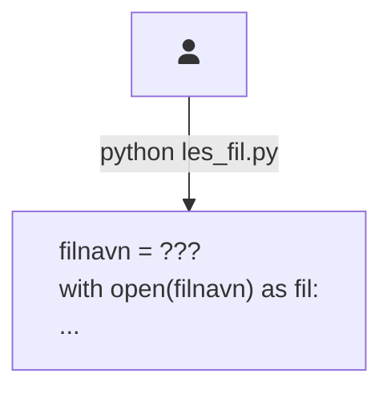
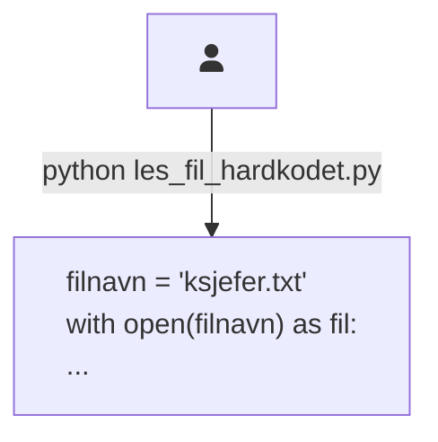
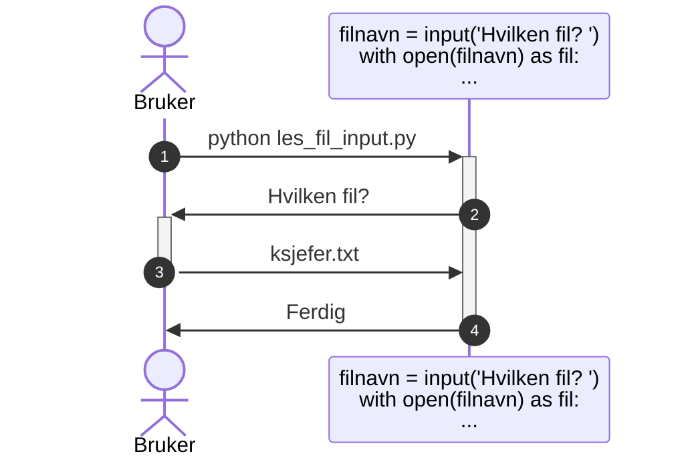
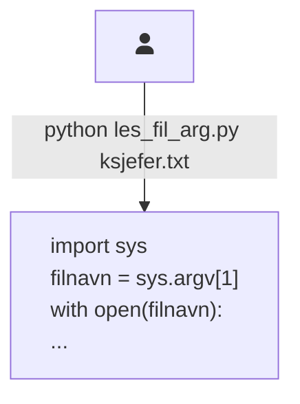

Programargumenter
=================

**💡 Læringsmål:**
_I dette kapitlet skal du bli kjent med hvordan du kan gi brukeren kontroll
over hva applikasjonen skal gjøre, uten at applikasjonen stopper opp underveis._


## Hvordan kan du la brukeren bestemme ting?

Hvordan kan applikasjonen din vite hvilken fil den skal lese fra?
Eller hvilken fil den skal skrive til?
Eller hva den i det hele tatt skal gjøre med innholdet i fila?

Før vi går i gang, kan du lage ei fil som heter `ksjefer.txt` med følgende innhold:

```
Olav Midttun
Kaare Fostervoll
Hans Jacob Ustvedt
Torolf Ester
Bjartmar Gjerde
Einar Førde
John G. Bernander
Hans-Tore Bjerkaas
Thor Gjermund Eriksen
Vibeke Fürst Haugen
```

Vi skal referere til denne fila når vi kjører eksempelprogrammet vi lager oss.

Vi ser på et eksempel der vi skal åpne ei fil og skrive innholdet av fila til terminalen.
Hvordan skal programmet vite hvilken fil som skal åpnes?



Vi tar en kikk på ulike måter vi kan hente filnavnet på.


### Hardkode verdien i koden

Den enkleste løsningen er å bestemme alt dette inni applikasjonen, såkalt *[hardkoding][wiki-hardcoding]*.
For eksempel kan du skrive filstien direkte i koden.



Fullstendig kodeeksempel:

```python
# les_fil_hardkodet.py
filnavn = "ksjefer.txt"
with open(filnavn) as fil:
  for linje in fil:
    print(linje, end="")
```

Dette kan fungere helt greit når du tester,
men det blir fryktelig upraktisk å måtte endre programmet hver gang du vil lese ei ny fil.


### Spørre underveis med `input()`

I [del 1.4 av kurset](../kap1/4_input.md) var vi innom [`input()`-funksjonen][doc-input],
som lar deg stille brukeren et spørsmål som hen må svare på før programmet fortsetter.



Fullstendig kodeeksempel:

```python
# les_fil_input.py
filnavn = input("Hvilken fil? ")
with open(filnavn) as fil:
  for linje in fil:
    print(linje, end="")
```

Dette fungerer bra for interaktive applikasjoner der brukeren skal sitte parat ved tastaturet hele veien,
men det er ofte mye mer praktisk for brukeren å kunne bestemme alt dette helt i starten,
og så gjøre noe annet mens programmet kjører.


### Gi verdien samtidig som du starter programmet

I resten av dette kapitlet skal vi se på _programargumenter_.
Dette er verdier som brukeren skriver samtidig som hen starter programmet ditt.
For eksempel:



Vi kommer tilbake til koden om litt,
men kan du se hvor brukeren har skrevet filnavnet hen?

Frem til nå har vi alltid skrevet `python` etterfulgt av et mellomrom og navnet på programmet vi ville kjøre.
Men du kan alltids legge til flere argumenter _etter_ navnet på skriptet (her `les_fil_arg.py`).
Dette er argumenter til programmet ditt, som det kan lese ut og nyttiggjøre seg av.


#### Funksjons- eller programargument?

Du kjenner kanskje igjen ordet _argument_ fra funksjoner.
Hvis vi skulle skrevet dette som en Python-funksjon som tok inn filnavnet som et _funksjonsargument_, ville det kanskje sett sånn her ut:

```python
# les_fil_func.py
def les_fil(filnavn):
  with open(filnavn) as fil:
    for linje in fil:
      print(linje, end="")

les_fil("ksjefer.txt")
```

Funksjons- og programargumenter handler begge to om å sende informasjon inn til koden.
Forskjellen ligger i om det er en _funksjon_ eller om det er _hele programmet_ som er mottaker.


## Lese programargumenter manuelt

La oss starte med den innebygde måten du kan lese argumenter på.

For å nyttiggjøre deg av de ekstra argumentene brukeren skriver,
kan du importere [`sys`-modulen][doc-sys].
Deretter kan du lese argumentene fra [lista `sys.argv`][doc-sys.argv].

Lista i `sys.argv` har alltid navnet på skriptet i posisjon 0.
Eventuelle programargumenter ligger i posisjon 1 og utover.


### Skrive `sys.argv` til terminalen

Er det litt forvirrende hvordan det du skriver i terminalen blir gjort om til `sys.argv` i Python?
Vi kan lage oss et program som lar oss se hvordan `sys.argv` ser ut, og eksperimentere med det:

```python
# print_argv.py
import sys

print(sys.argv)
```

✍️ **Oppgave:**
_Lag `print_argv.py` lokalt hos deg, og eksperimenter med å kjøre det i terminalen.
Hva printes når du ikke oppgir noe programargument?
Hva printes når du gir mange programargumenter?_


### Fil-eksemplet med `sys.argv`

Ovenfor gikk vi gjennom flere måter programmet ditt kan ta inn et filnavn på,
men vi gikk aldri inn på hvordan eksemplet ville se ut med `sys.argv`.
Her er det eksemplet:

```python
# les_fil_arg.py
import sys

with open(sys.argv[1]) as fil:
  for linje in fil:
    print(linje, end="")
```

Eksempel på kjøring:

```shell
kurs $> python les_fil_arg.py ksjefer.txt
Olav Midttun
Kaare Fostervoll
Hans Jacob Ustvedt
Torolf Ester
Bjartmar Gjerde
Einar Førde
John G. Bernander
Hans-Tore Bjerkaas
Thor Gjermund Eriksen
Vibeke Fürst Haugen
```


✍️ **Oppgave:**
_Hva skjer hvis du bare kjører `python les_fil_arg.py`, uten at du oppgir noe navn etterpå?
Lag deg en teori og test det deretter ut. Skjedde det du forventa?_


## Bruke `click` til å tolke programargumenter

Selv om det er greit å vite om `sys.argv`, så blir det fort mye arbeid å bruke den direkte.
Vi skal derfor bruke et verktøy som sparer oss for det arbeidet.
Under panseret vil vi fortsatt bruke `sys.argv`,
men verktøyet leser fra lista selv og gir oss «gratis» feilhåndtering og mye mer.

Et sånt verktøy er inkludert i Python og heter [`argparse`][doc-argparse],
men i dette kurset skal vi bruke et tredjepartsbibliotek kalt [`click`][click].

Start med å installere click:

```shell-session
kurs $> poetry add click
Using version ^8.1.3 for click

Updating dependencies
Resolving dependencies... (0.2s)

Writing lock file

Package operations: 1 install, 0 updates, 0 removals

  • Installing click (8.1.3)
```

Versjonsnummeret (8.1.3) vil sannsynligvis være høyere hos deg, men det gjør ikke noe.

Vi kan starte med å konvertere fillesing-skriptet vårt til å bruke `click`:

```python
# les_fil_click.py
import click


@click.command()
@click.argument("filnavn")
def les_fil(filnavn):
  with open(filnavn) as fil:
    for linje in fil:
      print(linje, end="")

les_fil()
```

Dette ser umiddelbart litt rart ut.
Hvorfor sender vi ingen argumenter til `les_fil()`-funksjonen?

Svaret er at _dekoratørene_ vi har lagt til – `@click.command()` og `@click.argument("filnavn")` – gjør om på hvordan funksjonen virker.
Den forventer derfor ikke å få noe argument når du kjører den.
Click vil i stedet lese `sys.argv` og sende inn det første _program_-argumentet til brukeren som _funksjons_-argumentet `filnavn`.

Når du kjører dette i terminalen, oppfører det seg ganske likt med `les_fil_arg.py`.
Men det øyeblikket du skriver flere eller færre programargumenter enn programmet forventer,
vil du se at vi har fått en del ny funksjonalitet.

```shell-session
kurs $> poetry run python les_fil_click.py ksjefer.txt
Olav Midttun
Kaare Fostervoll
Hans Jacob Ustvedt
Torolf Ester
Bjartmar Gjerde
Einar Førde
John G. Bernander
Hans-Tore Bjerkaas
Thor Gjermund Eriksen
Vibeke Fürst Haugen
kurs $> poetry run python les_fil_click.py ksjefer.txt hei
Usage: les_fil_click.py [OPTIONS] FILNAVN
Try 'les_fil_click.py --help' for help.

Error: Got unexpected extra argument (hei)
kurs $> poetry run python les_fil_click.py
Usage: les_fil_click.py [OPTIONS] FILNAVN
Try 'les_fil_click.py --help' for help.

Error: Missing argument 'FILNAVN'.
kurs $> poetry run python les_fil_click.py --help
Usage: les_fil_click.py [OPTIONS] FILNAVN

Options:
  --help  Show this message and exit.
kurs $>
```

Før vi fortsetter, kan det være lurt å lære litt mer om hvordan kommandoer er strukturert.


## Anatomien til en kommando

Du har så langt brukt terminalen til å kjøre kommandoer,
men har du tenkt over hvordan disse kommandoene er bygd opp?

Vi kan starte med kommandoen du bruker for å kjøre et Python-skript:

```shell-session
kurs $> python les_fil_click.py ksjefer.txt
```

Denne består av tre deler som er atskilt med mellomrom:

0. `python`: Dette er navnet på, eller filstien til, programmet vi ønsker å kjøre
1. `les_fil_click.py`: Dette er det første argumentet som blir gitt til `python`-kommandoen
2. `ksjefer.txt`: Dette er det andre argumentet som blir gitt til `python`-kommandoen

**Mellomrom er meningsbærende**: De skiller mellom de ulike delene av en kommando.
Hvis du lager ei fil der navnet inneholder et mellomrom,
må du derfor bruke hermetegn for å indikere at mellomrommet _ikke_ skiller mellom to argument,
men i stedet inngår i ett og samme argument.

Her er en kommando som vil bli tolket feil:

```shell-session
kurs $> python les fil click.py lyttertall p1.csv
python3.10: can't open file '/home/n123456/kurs/les': [Errno 2] No such file or directory
```

Denne kommandoen består av seks deler:

0. `python`
1. `les`
2. `fil`
3. `click.py`
4. `lyttertall`
5. `p1.csv`

Selvfølgelig finnes det ikke noe skript som heter `les`,
så derfor feiler `python` med en feilmelding om at fila ikke finnes.

Hvis det hadde fantes ei fil som het `les`, kunne den lest `fil`, `click.py`, `lyttertall` og `p1.csv` fra `sys.argv`.

La oss i stedet bruke hermetegn rundt filstiene:

```shell-session
kurs $> python "les fil click.py" "lyttertall p1.csv"
```

Denne kommandoen består av tre deler:

0. `python`
1. `les fil click.py`
2. `lyttertall p1.csv`

Når `les fil click.py` kjører, kan den lese `lyttertall p1.csv` fra `sys.argv[1]`.


## Tips og triks når du skriver kommandoer i terminalen

**Autofullfør**: Når du skriver kommandoer i terminalen,
kan du bruke `[TAB]`-tasten til å fullføre argumentet du skriver på.
Hvis det du har skrevet er nok til å vite hvilken fil du tenker på,
kan du fylle ut resten med ett trykk.
Er det flere filer, må du gjerne trykke flere ganger for å få forslag eller gå gjennom forslagene.

Dette er veldig nyttig siden du ofte vil skrive filnavn i kommandoer.
Du kan bruke autofullfør både når du skal skrive hvilket skript Python-programmet skal kjøre,
og når du skal fortelle skriptet hvilken fil du vil lese fra eller skrive til.

**Historikk**: Bruk `[PILTAST OPP]` og `[PILTAST NED]` til å bla gjennom historikken.
Vil du kjøre den forrige kommandoen din én gang til,
kan du trykke `[PILTAST OPP]` én gang, etterfulgt av `[ENTER]`.
Du kan også endre på kommandoen etter at du har bladd deg opp til den,
for eksempel hvis du vil kjøre det samme med en liten endring.


## Hjelp til selvhjelp

Det er god kotyme å gi brukeren en kort oppsummering over hvordan du skal bruke programmet hvis brukeren ikke skriver noe programargument,
i de tilfellene hvor det er påkrevd.
Sånne korte oppsummeringer pleier ikke å være lengre enn 2-3 linjer,
og tar med en mal på hvordan kjøringer av programmet kan se ut.

I tillegg er det et standard valg som alle programmer bør støtte:
`--help`, gjerne med kortvalget `-h`.
Hvis brukeren spesifiserer dette valget, så skal ikke programmet gjøre noe likevel.
Det skal i stedet printe en hjelpetekst til terminalen og så avslutte.
Hjelpeteksten skal forklare hva programmet gjør, hvilke argumenter du må oppgi og hvilke valg du kan bruke.

Tanken er at du skal få den hjelpen du trenger,
uten at du må lese deg opp på et dokument som ligger et eller annet sted
eller lese deg opp på hvordan skriptet er skrevet.


### Lage hjelpetekst til Click

Click gir automatisk applikasjonen din støtte for `-h` og `--help`.

Click leser automatisk [_doc-strengen_][doc-glossary.docstring] som du skriver først i funksjonen.
Her bør du skrive en oppsummering på hva skriptet ditt gjør.

Det vanlige er å lage en kort oppsummering på én linje,
etterfulgt av ei blank linje og så ei lengre forklaring som godt kan vare flere linjer.

La oss gi eksempelskriptet vårt en egen introduksjon:

```python
# les_fil_click_v2.py
import click


@click.command()
@click.argument("filnavn")
def les_fil(filnavn):
  """
  Skriv innholdet av fila med filstien FILNAVN til terminalen.
  """
  
  with open(filnavn) as fil:
    for linje in fil:
      print(linje, end="")

les_fil()
```

Nå vil hjelpeteksten være enda mer hjelpsom:

```shell
kurs $> poetry run python les_fil_click_v2.py --help
Usage: les_fil_click_v2.py [OPTIONS] FILNAVN

  Skriv innholdet av fila med filstien FILNAVN til terminalen.

Options:
  --help  Show this message and exit.
```


## Posisjonelle argumenter

Den mest grunnleggende formen for programargument er argument
som får sin mening ene og alene basert på _hvor_ det står – altså posisjonen.

For eksempel har vi kommandoen `cp` (kort for _copy_) som lager en kopi av ei fil.
Den tar inn to posisjonelle argumenter: Kildefila, og den nye kopien du vil lage:

```shell
kurs $> cp les_fil_click_v2.py les_fil_click_v3.py
```

At `les_fil_click_v2.py` er kildefila, er bestemt ene og alene av at den er satt først.
Tilsvarende vet vi at `les_fil_click_v3.py` er navnet på kopien,
siden det er det andre posisjonelle argumentet.

Med `click` så definerer du nye argumenter ved å bruke `@click.argument("argumentnavn")` rett før funksjonsdefinisjonen.
Posisjonen til `@click.argument(...)` bestemmer den forventede posisjonen til programargumentet når brukeren kjører skriptet.

Vi kan legge til flere argumenter til utlesingsskriptet vårt, for eksempel for å ta inn en prefiks som skal legges til hver linje:

```python
# les_fil_prefiks.py
import click


@click.command()
@click.argument("filnavn")
@click.argument("prefiks")
def les_fil_med_prefiks(filnavn, prefiks):
  """
  Skriv PREFIKS + innholdet av fila med filstien FILNAVN til terminalen.
  
  Prefikset PREFIKS blir skrevet ut på starten av hver linje.
  """

  with open(filnavn) as fil:
    for linje in fil:
      print(prefiks + linje, end="")

les_fil_med_prefiks()
```

Eksempel på kjøring:

```shell
kurs $> poetry run python les_fil_prefiks.py --help
Usage: les_fil_prefiks.py [OPTIONS] FILNAVN PREFIKS

  Skriv PREFIKS + innholdet av fila med filstien FILNAVN til terminalen.

  Prefikset PREFIKS blir skrevet ut på starten av hver linje.

Options:
  --help  Show this message and exit.
kurs $> poetry run python les_fil_prefiks.py ksjefer.txt "Kringkastingssjef: "
Kringkastingssjef: Olav Midttun
Kringkastingssjef: Kaare Fostervoll
Kringkastingssjef: Hans Jacob Ustvedt
Kringkastingssjef: Torolf Ester
Kringkastingssjef: Bjartmar Gjerde
Kringkastingssjef: Einar Førde
Kringkastingssjef: John G. Bernander
Kringkastingssjef: Hans-Tore Bjerkaas
Kringkastingssjef: Thor Gjermund Eriksen
Kringkastingssjef: Vibeke Fürst Haugen
```


### Frivillige, posisjonelle argumenter

Alle argumentene du legger til vil være obligatoriske.
Det gjør `les_fil_prefiks.py` litt ufleksibel.
Må vi virkelig ha to forskjellige program, ett med prefiks og ett uten?

Hvis vi gjør PREFIKS-argumentet _frivillig_, kan ett og samme skript brukes enten du vil ha prefiks eller ikke.

For å gjøre et argument frivillig, spesifiserer du hvilken verdi argumentet skal få når brukeren ikke tar det med.
Det gjør du med det navngitte argumentet `default=...` i `click.argument(...)`.

I eksemplet med prefiksen, så kan vi bare bruke en tom streng som forvalgt verdi.
Da kommer vi til å konkattenere en tom streng med hver linje i fila,
men til gjengjeld slipper vi å lage spesiell kode for når vi ikke har noe prefiks.
Vi behandler rett og slett tilfellet med ingen prefiks som å være likt tilfellet med prefiks lik `""`.

```python
# les_fil_click_v3.py
import click


@click.command()
@click.argument("filnavn")
@click.argument("prefiks", default="")
def les_fil(filnavn, prefiks):
  """
  Skriv PREFIKS + innholdet av fila med filstien FILNAVN til terminalen.

  Prefikset PREFIKS blir skrevet ut på starten av hver linje, hvis angitt.
  """

  with open(filnavn) as fil:
    for linje in fil:
      print(prefiks + linje, end="")

les_fil()
```

Eksempel på kjøring:

```shell
kurs $> poetry run python les_fil_click_v3.py ksjefer.txt --help
Usage: les_fil_click_v3.py [OPTIONS] FILNAVN [PREFIKS]

  Skriv PREFIKS + innholdet av fila med filstien FILNAVN til terminalen.

  Prefikset PREFIKS blir skrevet ut på starten av hver linje, hvis angitt.

Options:
  --help  Show this message and exit.
kurs $> poetry run python les_fil_click_v3.py ksjefer.txt "Kringkastingssjef: "
Kringkastingssjef: Olav Midttun
Kringkastingssjef: Kaare Fostervoll
Kringkastingssjef: Hans Jacob Ustvedt
Kringkastingssjef: Torolf Ester
Kringkastingssjef: Bjartmar Gjerde
Kringkastingssjef: Einar Førde
Kringkastingssjef: John G. Bernander
Kringkastingssjef: Hans-Tore Bjerkaas
Kringkastingssjef: Thor Gjermund Eriksen
Kringkastingssjef: Vibeke Fürst Haugen
kurs $> poetry run python les_fil_click_v3.py ksjefer.txt
Olav Midttun
Kaare Fostervoll
Hans Jacob Ustvedt
Torolf Ester
Bjartmar Gjerde
Einar Førde
John G. Bernander
Hans-Tore Bjerkaas
Thor Gjermund Eriksen
Vibeke Fürst Haugen
```

Legg merke til oppsummeringslinja i hjelpeteksten:

```
Usage: les_fil_click_v3.py [OPTIONS] FILNAVN [PREFIKS]
```

PREFIKS er plassert mellom klammeparanteser (`[` og `]`).
Dette er en konvensjon innenfor terminalprogram, og signaliserer at PREFIKS er frivillig.
På samme måte er OPTIONS (som for eksempel `--help`) frivillig.
FILNAVN, på den andre siden, er obligatorisk, siden det ikke er omsluttet av klammeparenteser.

# TODO: Fortsett


## Signalisering av feil

Alle program har en avslutningskode, _exit code_ på engelsk, som blir satt når programmet avslutter.
Denne blir brukt for å kommunisere hvordan det gikk med programmet.
For eksempel kan et skript som består av flere andre skript velge å avbryte kjøringa hvis et av programmene flagger at noe gikk galt.

Hvis alt gikk bra, så skal programmet avslutte med avslutningskode `0`.

Alle andre avslutningskoder indikerer at noe gikk galt.
Du vil typisk bruke `1` til å indikere at noe galt har skjedd.

Python-programmer trenger som regel ikke tenke på dette.
Hvis skriptet kjører ferdig uten at det krasjer, vil det avslutte med avslutningskode lik `0`.
Hvis skriptet derimot krasjer, avslutter det med avslutningskode lik `1`.
Det eneste måtte være hvis du avslutter skriptet tidlig med [`sys.exit`][doc-sys.exit],
som tar inn avslutningskoden som et argument.


## Ulike typer programargumenter

Det er i prinsippet ingen regler for hvordan programmet ditt håndterer programargumenter.
Men det har utviklet seg en bestepraksis over tid for hvordan kommandolinjeprogram bør oppføre seg.

For det første kan du dele programargumenter i to typer:
* Posisjonelle argumenter
* Frivillige tilvalg

For det andre er det noen uskrevne regler for hvordan programmet ditt dokumenterer seg selv,
og hvordan det håndterer manglende eller ugyldige data fra brukeren.


### Posisjonelle argumenter

```python
# hilsen_tittel.py

@click.command()
@click.argument("tittel")
@click.argument("navn")
def hils(tittel, navn):
  """
  Ta i mot hilsen fra NAVN med TITTEL.
  
  Skriv en hilsen tilbake til den navngitte personen
  med den angitte tittelen, i terminalen.
  """
  print(f"Så hyggelig å få hilst på vår kjære {tittel}, {navn}!")
  
hils()
```

Eksempel på kjøring:

```shell
kurs $> poetry run python hilsen_tittel.py kringkastingssjef Vibeke
Så hyggelig å få hilst på vår kjære kringkastingssjef, Vibeke!
```


### Frivillige tilvalg

Tilvalg, eller option på engelsk, er en type programargument som starter med bindestrek.
Fordi tilvalget har et navn som du oppgir, spiller det ingen rolle hvilken rekkefølge du bruker.

#### Korte og lange tilvalg

Ett og samme tilvalg har som oftest to varianter:
En kort énbokstavsvariant (short option) og en lang fullvariant (long option).
De starter med henholdsvis én og to bindestreker.
For eksempel `-a` i `ls -a`, eller den ekvivalente `ls --all`.

Når du til daglig sitter i terminalen er det praktisk å bruke korte tilvalg,
men hvis du skriver ned kommandoer i et skript eller i en guide,
bør du bruke lange tilvalg sånn at leseren lettere forstår hva de gjør.


#### Flagg

Noen tilvalg står alene og kalles _flagg_.
De signaliserer at noe skal aktiveres eller deaktiveres
simpelthen fordi de er der.
  
Hvis du trenger å bruke flere flagg og bruker énbokstavsvarianten,
kan du bruke én bindestrek og så liste opp alle flaggene etter hverandre.
For eksempel er `ls -larth` ekvivalent med `ls -l -a -r -t -h`.


#### Tilvalg med verdi

Andre tilvalg tar inn en verdi.
Den kan du angi som det neste programargumentet.
For lange tilvalg kan du alternativt bruke et likhetstegn.

Som et eksempel kan vi oversette `ls -larth`-kommandoen ovenfor til å bruke lange tilvalg.
Da bruker vi `--format`, som tar inn typen format, i dette tilfellet `long`.
Og vi bruker `--sort`, som tar inn hva vi skal sortere på, i dette tilfellet `time`.

```shell
kurs $> ls --format long --all --reverse --sort time --human-readable
```

Alternativt med likhetstegn i stedet for mellomrom mellom tilvalg og tilhørende verdi:

```shell
kurs $> ls --format=long --all --reverse --sort=time --human-readable
```

## Bruke `click` til å tolke programargumenter

Hvis du skal følge bestepraksisen beskrevet ovenfor, blir det mye arbeid.
Derfor finnes det flere verktøy som tolker `sys.argv` for deg,
sånn at du slipper å gjøre den jobben selv.
Et av de er inkludert i Python og heter [`argparse`][argparse],
men i dette kurset skal vi bruke et tredjepartsbibliotek kalt [`click`][click].

[argparse]: https://docs.python.org/3/howto/argparse.html#id1
[click]: https://click.palletsprojects.com/en/8.1.x/

Start med å installere click:

```shell-session
kurs $> poetry add click
Using version ^8.1.3 for click

Updating dependencies
Resolving dependencies... (0.2s)

Writing lock file

Package operations: 1 install, 0 updates, 0 removals

  • Installing click (8.1.3)
```

La oss starte med å re-implementere `print_fil.py` med `click`.
Skriptet skal fortsatt ta inn et posisjonelt argument med navnet på fila vi skal skrive til terminalen.

```python
# print_fil_click.py
import click

@click.command()
@click.argument('valgt_fil')
def print_fil(valgt_fil):
  """Skriv innholdet av VALGT_FIL til terminalen."""
  with open(valgt_fil) as fil:
    for linje in fil:
      print(linje, end='')

print_fil()
```

Her bruker vi noe som kalles for _dekoratører_.
De kjennetegnes av funksjonskall med en alfakrøll foran seg,
som er listet opp rett før en funksjonsdefinisjon.
I tilfellet her er `click.command()` og `click.argument('valgt_fil')`
dekoratører, som dekorerer `print_fil`-funksjonen.
Nøyaktig _hva_ dekoratører gjør sparer vi til en frivillig ekstra-del,
men vi nøyer oss med å si at de kan elte og kna på funksjonen du definerer sånn at den kan fungere på en annen måte enn den ellers ville gjort.

Som du ser, er `click` orientert rundt funksjoner som blir gjort om til kommandoer.
Du spesifiserer hvilke valg og argumenter som kommandoen skal ta i mot,
og tar dem inn som funksjonsargumenter.
Pass på at navnet på argumentet stemmer overens med navnet som er gitt i [`click.argument`][doc-click.argument].

Eksempel på kjøring:

```shell
kurs $> poetry run python print_fil_click.py 
Usage: print_fil_click.py [OPTIONS] VALGT_FIL
Try 'print_fil_click.py --help' for help.

Error: Missing argument 'VALGT_FIL'.
kurs $> poetry run python print_fil_click.py --help
Usage: print_fil_click.py [OPTIONS] VALGT_FIL

  Skriv innholdet av VALGT_FIL til terminalen.

Options:
  --help  Show this message and exit.
kurs $> poetry run python print_fil_click.py print_fil_click.py
import click

@click.command()
@click.argument('valgt_fil')
def print_fil(valgt_fil):
  """Skriv innholdet av VALGT_FIL til terminalen."""
  with open(valgt_fil) as fil:
    for linje in fil:
      print(linje, end='')

print_fil()
kurs $> # Eksempel på fil som ikke finnes
kurs $> poetry run python print_fil_click.py finnes_ikke.txt
Traceback (most recent call last):
  File "/home/n123456/kurs/print_fil_click.py", line 11, in <module>
    print_fil()
  File "/home/n123456/.cache/pypoetry/virtualenvs/kurs-hRZI2kkF-py3.10/lib/python3.10/site-packages/click/core.py", line 1130, in __call__
    return self.main(*args, **kwargs)
  File "/home/n123456/.cache/pypoetry/virtualenvs/kurs-hRZI2kkF-py3.10/lib/python3.10/site-packages/click/core.py", line 1055, in main
    rv = self.invoke(ctx)
  File "/home/n123456/.cache/pypoetry/virtualenvs/kurs-hRZI2kkF-py3.10/lib/python3.10/site-packages/click/core.py", line 1404, in invoke
    return ctx.invoke(self.callback, **ctx.params)
  File "/home/n123456/.cache/pypoetry/virtualenvs/kurs-hRZI2kkF-py3.10/lib/python3.10/site-packages/click/core.py", line 760, in invoke
    return __callback(*args, **kwargs)
  File "/home/n123456/kurs/print_fil_click.py", line 7, in print_fil
    with open(valgt_fil) as fil:
FileNotFoundError: [Errno 2] No such file or directory: 'finnes_ikke.txt'
```

Noen punkter å notere seg:
* Click sjekker at brukeren har spesifisert det posisjonelle argumentet
* Click skriver automatisk en melding til terminalen når argumentet mangler
* Click skriver en automatisk generert hjelpemelding til terminalen når brukeren spesifiserer `--help` som et valg, uten at den kjører koden inni `print_fil`-funksjonen
* Doc-strengen vi la til helt i starten av funksjonen blir tatt med i hjelpeteksten
* Stacktracen som skrives til terminalen når skriptet krasjer,
  har med seg en del ekstra lag med funksjonskall siden det er en del mekanismer i Click som kjører før selve `print_fil`-funksjonen vår kjører


## Valg med Click

I eksemplet ovenfor så vi at `click.argument` brukes til å registrere at vi skal ta inn et posisjonelt argument.
Tilsvarende kan vi bruke [`click.option`][doc-click.option] til å registrere et valg.

### Flagg

La oss utvide eksemplet fra i stad med et valg som lar deg skru på nummerering av linjene:

```python
# print_fil_click_v2.py
import click

@click.command()
@click.option('-n', '--number', is_flag=True, help='Skriv linjenummer foran hver linje.')
@click.argument('valgt_fil')
def print_fil(number, valgt_fil):
  """Skriv innholdet av VALGT_FIL til terminalen."""
  with open(valgt_fil) as fil:
    for linjenummer, linje in enumerate(fil, start=1):
      # Skriv linjenummer hvis aktivert
      if number:
        # Sørg for konsekvent venstremargin på koden
        # (for filer på opptil 999 linjer)
        print(f'{linjenummer: 3d}: ', end='')
      # Skriv linja
      print(linje, end='')

print_fil()
```

Med `click.option` spesifiserer vi at vi ønsker å legge til et valg.
Kortvalget er `'-n'`, mens langvalget er `'--number'`.
Takket være `is_flag=True` så vet Click at det er flagg,
og at det derfor ikke skal ta inn en verdi.
Da vil det også bli tolket som et boolsk valg,
som er `False` med mindre brukeren tar det med.
Teksten i `help='...'` blir tatt med i hjelpeteksten for dette valget.

For å få linjenummeret, bruker vi funksjonen [`enumerate`][docs-builtins.enumerate].
Den tar inn noe som du kan iterere over, for eksempel `['a', 'b', 'c']`,
og legger på et løpenummer, for eksempel `[(0, 'a'), (1, 'b'), (2, 'c')]`.
Siden elementene er tupler, kan vi pakke dem ut i `for` ved å skrive `for linjenummer, linje ...`.
For at ikke første linje skal bli kalt linje 0, ber vi `enumerate` om å starte på 1.

Når vi skriver `f'{linjenummer: 3d}: '` bruker vi formateringsspråket til å be om at linjenummeret formateres med ledende mellomrom, sånn at linjenummeret alltid tar opp tre tegn.
Siden vi forteller `print` at den ikke skal skrive noe linjeskift til terminalen etter teksten vår,
vil linja som skrives ut havne på samme linje som linjenummeret vårt.

Eksempel på kjøring:

```shell
kurs $> poetry run python print_fil_click_v2.py print_fil_click_v2.py --help
Usage: print_fil_click_v2.py [OPTIONS] VALGT_FIL

  Skriv innholdet av VALGT_FIL til terminalen.

Options:
  -n, --number  Skriv linjenummer foran hver linje.
  --help        Show this message and exit.
kurs $> poetry run python print_fil_click_v2.py print_fil_click_v2.py --number
  1: import click
  2: 
  3: @click.command()
  4: @click.option('-n', '--number', is_flag=True, help='Skriv linjenummer foran hver linje.')
  5: @click.argument('valgt_fil')
  6: def print_fil(number, valgt_fil):
  7:   """Skriv innholdet av VALGT_FIL til terminalen."""
  8:   with open(valgt_fil) as fil:
  9:     for linjenummer, linje in enumerate(fil, start=1):
 10:       # Skriv linjenummer hvis aktivert
 11:       if number:
 12:         # Sørg for konsekvent venstremargin på koden
 13:         # (for filer på opptil 999 linjer)
 14:         print(f'{linjenummer: 3d}: ', end='')
 15:       # Skriv linja
 16:       print(linje, end='')
 17: 
 18: print_fil()
```

### Valg som tar inn verdi

La oss gi brukeren mulighet til å filtrere bort linjer som er for korte.
For eksempel vil vi at `poetry run python print_fil_click_v3.py --min-length 40`
bare skriver ut linjene som er 40 tegn eller lengre.
Hvis brukeren ikke bruker `--min-length`, gjør vi ikke noen filtrering:

```python
# print_fil_click_v3.py
import click

@click.command()
@click.option('-n', '--number', is_flag=True, help='Skriv linjenummer foran hver linje.')
@click.option('--min-length', metavar='LENGDE', default=0, help='Hopp over linjer med færre tegn enn LENGDE.')
@click.argument('valgt_fil')
def print_fil(number, min_length, valgt_fil):
  """Skriv innholdet av VALGT_FIL til terminalen."""
  with open(valgt_fil) as fil:
    for linjenummer, linje in enumerate(fil, start=1):
      # Hopp over linjer med for få tegn
      antall_tegn_før_linjeskift = len(linje.rstrip())
      if antall_tegn_før_linjeskift < min_length:
        continue

      # Skriv linjenummer hvis aktivert
      if number:
        # Sørg for konsekvent venstremargin på koden
        # (for filer på opptil 999 linjer)
        print(f'{linjenummer: 3d}: ', end='')

      # Skriv linja
      print(linje, end='')

print_fil()
```

Eksempel på kjøring:

```shell
kurs $> poetry run python print_fil_click_v3.py --help
Usage: print_fil_click_v3.py [OPTIONS] VALGT_FIL

  Skriv innholdet av VALGT_FIL til terminalen.

Options:
  -n, --number         Skriv linjenummer foran hver linje.
  --min-length LENGDE  Hopp over linjer med færre tegn enn LENGDE.
  --help               Show this message and exit.
kurs $> poetry run python print_fil_click_v3.py print_fil_click_v3.py --min-length 55 --number
  4: @click.option('-n', '--number', is_flag=True, help='Skriv linjenummer foran hver linje.')
  5: @click.option('--min-length', metavar='LENGDE', default=0, help='Hopp over linjer med færre tegn enn LENGDE.')
```

Her har vi spesifisert valget `--min-length`.
Hvis brukeren ikke bruker valget, blir minstelengden satt til 0 på grunn av `default`-argumentet.
I tillegg skjønner Click at brukeren må oppgi et _tall_,
siden default-verdien vår er et tall.
Alternativt kunne vi spesifisert `type=int` som enda et argument til `click.option`.

Vi bruker `metavar='LENGDE'` til å bestemme hva placeholderen for verdien skal være i hjelpeteksten.
Hadde vi ikke spesifisert metavar hadde den vært `INTEGER` siden det er et heltall.


## Andre ting du kan gjøre med Click

Når du får et nytt verktøy i hendene frister det kanskje ikke å slå opp bruksanvisningen,
men når det gjelder programvarepakker så kan dokumentasjonen være vel verdt et besøk.
Ofte kan verktøyet ha løst problemer som du ikke trodde det løste,
eller ha muligheter du ikke har tenkt på.
Sjekk ut [den offisielle dokumentasjone til Click][click] for å oppdage mange flere ting du kan gjøre, som for eksempel:

* Sette et minimum og/eller et maksimum for et valgs verdi, for eksempel kan `--min-length` ovenfor begrenses sånn at negative tall ikke er tillatt
* Be Click om å sjekke at et argument eller et valgs verdi er en gyldig filsti som peker mot en eksisterende fil
* Be Click spørre brukeren om verdier på valg som brukeren ikke bruker (likt `input()`)
* Lage program som kan gjøre flere ting, avhengig av hvilken underkommando brukeren spesifiserer (på samme måte som `poetry` gjør ulike ting avhengig om du skriver `poetry add` eller `poetry run` og så videre)
* Åpne opp en editor som brukeren kan bruke til å redigere ei fil
* Vise en progressbar

✍️ **Oppgave:**
_Kan du skrive om den store oppgaven fra dag 1 sånn at du tar inn navnet på JSON-fila fra programargumentene i stedet for at den ligger i koden?_


## Videre lesning

* [Click-dokumentasjonen][click]
* [12 Factor CLI Apps](https://medium.com/@jdxcode/12-factor-cli-apps-dd3c227a0e46)
* [Command Line Interface Guidelines](https://clig.dev/)
* [argparse-dokumentasjonen][doc-argparse]

[wiki-hardcoding]: https://en.wikipedia.org/wiki/Hard_coding
[doc-input]: https://docs.python.org/3/library/functions.html#input
[doc-sys]: https://docs.python.org/3/library/sys.html
[doc-sys.argv]: https://docs.python.org/3/library/sys.html#sys.argv
[doc-sys.exit]: https://docs.python.org/3/library/sys.html#sys.exit
[doc-sys.orig_argv]: https://docs.python.org/3/library/sys.html#sys.orig_argv
[doc-argparse]: https://click.palletsprojects.com/en/8.1.x/
[click]: https://click.palletsprojects.com/en/8.1.x/
[doc-glossary.docstring]: https://docs.python.org/3/glossary.html#term-docstring
[doc-click.option]: https://click.palletsprojects.com/en/8.1.x/options/
[doc-click.argument]: https://click.palletsprojects.com/en/8.1.x/arguments/
[docs-builtins.enumerate]: https://docs.python.org/3/library/functions.html#enumerate
