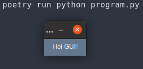
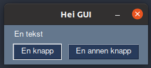

Grafiske brukergrensesnitt med PySimpleGUI
==========================================
**💡 Læringsmål:** _I dette kapitlet lærer du litt om hva grafiske brukergrensesnitt er, og du får laget ditt første grafiske brukergrensesnitt med PySimpleGUI._

Hva er et grafisk brukergrensesnitt?
------------------------------------
Programmer som har et grafisk brukergrensesnitt, er programmer som lar oss interagere med det på en visuell måte. Det er programmer som viser oss ett eller flere vinduer, hvor vi kan klikke på knapper, fylle inn tekst i bokser, og se informasjon og resultater tegnet som mer eller mindre hjelpsomme visuelle elementer. Kort fortalt: "vanlige" programmer.

Du har allerede laget programmer med kommandolinje-baserte brukergrensesnitt i dette kurset. Sånne typer programmer var vanligere før, og brukes fremdeles mye av folk som jobber med utvikling, eller andre datatekniske ting. Det er enklere å utvikle, men kan være litt vanskelige å bruke, og noen ganger kan man få bedre innsikt i dataene man jobber med, hvis de fremstilles på en visuell måte.

I dag er det programmer med grafiske brukergrensesnitt som er de vanligste. De er faktisk så vanlige, at vi typisk sløyfer ordet grafisk, og bare sier at programmet har et brukergrensesnitt, når vi snakker om programmer med grafiske brukergrensesnitt. Den engelske forkortelsen GUI (Graphical User Interface) er også mye brukt.

Et enkelt brukergrensesnitt med PySimpleGUI
-------------------------------------------
Når man lager brukergrensesnitt, er det sjelden man starter helt fra bunnen. I dette kurset har vi valgt å ta utgangspunkt i rammeverket [PySimpleGUI](https://www.pysimplegui.org/en/latest/), som er utviklet for å gjøre det lett å komme i gang med å lage enkle brukergrensesnitt i Python.

### Installasjon av PySimpleGUI
PySimpleGUI er en pakke, og kan [installeres med Poetry](../kap3/1_pakkebehandler.md#legge-til-avhengigheter), som andre pakker. Start med å lage en egen mappe under `kurs/`-mappen, for eksempel `kurs/gui/`. Her lager du et nytt Python-prosjekt med `poetry init`.

```shell
$> cd kurs/gui/
kurs/gui $> poetry init

This command will guide you through creating your pyproject.toml config.

Package name [gui]:  hei-gui
Version [0.1.0]:  1.0.0
Description []:  Mitt føreste brukergrensesnitt
Author [Teodor <teodor@test.no>, n to skip]:
License []:
Compatible Python versions [^3.8]:

Would you like to define your main dependencies interactively? (yes/no) [yes] no
Would you like to define your development dependencies interactively? (yes/no) [yes] no
Generated file

[tool.poetry]
name = "hei-gui"
version = "1.0.0"
description = "Mitt føreste brukergrensesnitt"
authors = ["Teodor <teodor@test.no>"]
readme = "README.md"
packages = [{include = "hei_gui"}]

[tool.poetry.dependencies]
python = "^3.8"


[build-system]
requires = ["poetry-core"]
build-backend = "poetry.core.masonry.api"


Do you confirm generation? (yes/no) [yes]
```

Når du har laget det nye Python-prosjektet, kan du installere PySimpleGUI med `poetry add pysimplegui`

```shell
kurs/gui $> poetry add pysimplegui
Creating virtualenv hei-gui-EIg_wOJT-py3.8 in /.cache/pypoetry/virtualenvs
Using version ^4.60.5 for pysimplegui

Updating dependencies
Resolving dependencies... (0.3s)

Writing lock file

Package operations: 1 install, 0 updates, 0 removals

  • Installing pysimplegui (4.60.5)
```

### Hei GUI!
Med PySimpleGUI installert, er vi klar til å lage et veldig enkelt brukergrensesnitt. Lag filen `kurs/gui/program.py`, og legg inn koden under.

```python
import PySimpleGUI as sg

layout = [
    [sg.Text('Hei GUI!')]
]

window = sg.Window('Hei GUI', layout)

running = True
while running:
    event, values = window.read()
    if event == sg.WIN_CLOSED:
        running = False

window.close()
```

Når dette er på plass, kan du kjøre programmet med `poetry run python program.py`. Hvis alt gikk bra, skal det dukke opp et lite vindu som vist under.



#### Hjelp! Programmet feiler med `ModuleNotFoundError: No module named 'tkinter'`
PySimpleGUI er avhengig av [tkinter](https://docs.python.org/3/library/tkinter.html). Ofte er tkinter allerede tilgjengelig, men på noen maskiner må man installere dette selv.

**Jeg bruker Ubuntu:**
På Ubuntu, eller andre Linux-distribusjoner som bruker [APT](https://en.wikipedia.org/wiki/APT_(software)), kan du installere tkinter med:

```shell
$> sudo apt install python3-tk
```

**Jeg bruker Mac:**
På Mac kan tkinter installeres med [Homebrew](https://brew.sh/):

```shell
$> brew install python-tk
```

**Jeg bruker Windows:**
På Windows skal tkinter være installert sammen med Python, så hvis du får denne feilen her, er det verdt å sjekke at du har installert Python 3, og ikke den veldig gamle versjonen Python 2.

_**Jeg har prøvd triksene over, men det fungerer fortsatt ikke:** Ta kontakt med en veileder, så kan dere sammen gå over [denne guiden](https://tkdocs.com/tutorial/install.html) som viser i mer detalj hvordan man installerer tkinter._

### Hvordan fungerer Hei GUI?
Topp! Vi har et vindu med tekst, men hvordan fungerer egentlig koden vi akkurat kjørte?

Det første vi gjorde var å importerer pakken PySimpleGUI, og gi den navnet sg i programmet vårt. Det betyr at når vi senere i programmet skriver `sg`, så er det kode i PySimpleGUI vi bruker.

```python
import PySimpleGUI as sg
```

Det neste vi gjorde var å lage en `layout`-variabel, som beskriver hvordan brukergrensesnittet skal se ut. PySimpleGUI fungerer sånn at man beskriver brukergrensesnitt som en liste med rader i skjermbildet, hvor hver rad inneholder en liste av PySimpleGUI-komponenter som skal vises på samme rad.

I koden vår trengte vi bare en rad med en `sg.Text`-komponent som inneholdt teksten "Hei GUI!", så derfor ble det hele ganske enkelt.

```python
layout = [
    [sg.Text('Hei GUI!')]
]
```

Skulle vi heller laget et brukergrensesnitt med en tekst, etterfulgt av to knapper på samme rad, kunne det heller sett ut litt som under.

```python
layout = [
    [sg.Text('En tekst')],
    [sg.Button('En knapp'), sg.Button('En annen knapp')]
]
```

Kjører vi programmet med denne `layout`-koden, ender vi opp med skjermbildet vist under.



Etter vi har fått på plass en `layout`, lager vi vinduet som brukergrensesnittet vises i. I tillegg gir vi vinduet en tittel, som er teksten som vises øverst i rammen på vinduet.

```python
window = sg.Window('Hei GUI', layout)
```

Hvis vi ikke gjorde noe mer, ville programmet vårt startet, åpnet vinduet, og med en gang lukket det. Vi trenger derfor å passe på at programmet ikke stopper før vi lukker vinduet. En måte å gjøre det på, er å lage en løkke som kjører så lenge brukeren vil kjøre. Inni løkken kan vi sjekke om brukeren har forsøkt å lukke vinduet, og hvis det er tilfelle, stopper vi løkken.

For å få til dette, har vi i programmet under laget en boolsk variabel `running`, som vi setter til `True` når programmet starter. Så bruker vi `while running:` for å få en løkke som kjører hele tiden. For å avslutte programmet, kan vi da sette `running` til `False`, når brukeren forsøker å lukke vinduet. Da vil løkken stoppe, og programmet avsluttes.

```python
running = True
while running:
    event, values = window.read()
    if event == sg.WIN_CLOSED:
        running = False
```

_Å kjøre en uendelig løkke, hvor vi gjentatte ganger sjekker om brukeren har gjort noe, er en vanlig teknikk å bruke når man lager programmer som skal vente på input fra en bruker. I dataspill har til og med denne løkken et eget navn: [game loop](https://en.wikipedia.org/wiki/Video_game_programming#Game_structure)._

Til slutt må vi passe på å lukke vinduet når brukeren har bedt om å lukke vinduet, og vi har brutt ut av den uendelige løkken.

```python
window.close()
```
